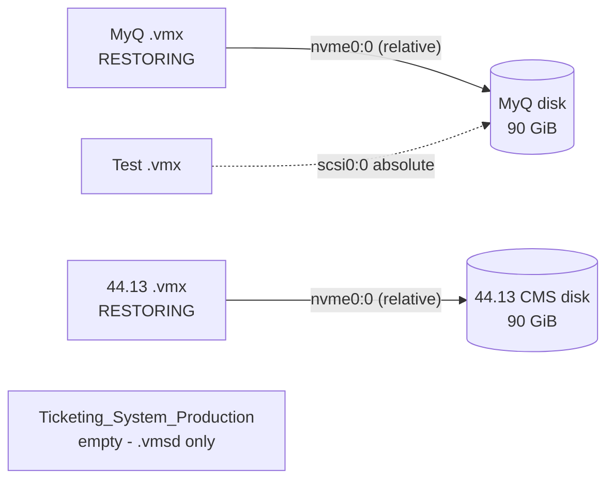
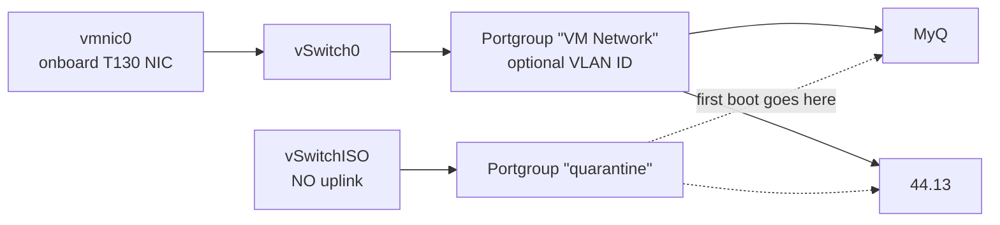
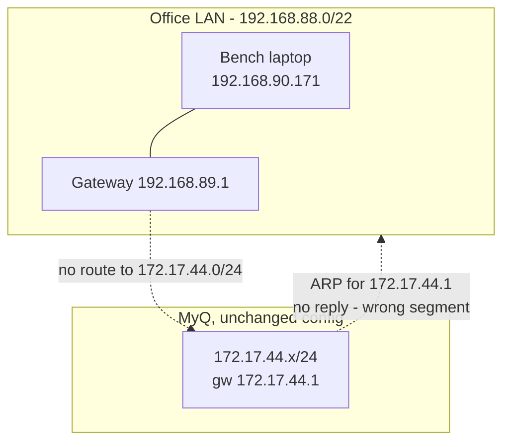
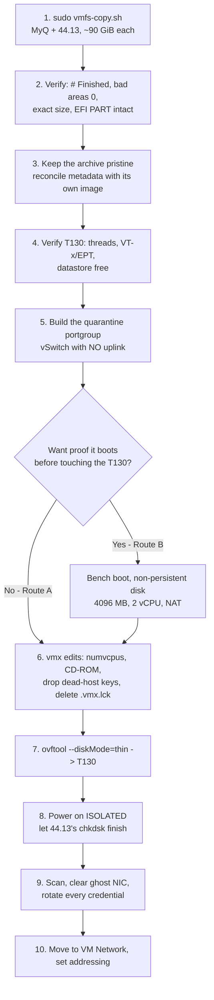

# Restoring the recovered servers

> Companion to `README.md`. That document covers getting the data **off** the dead
> ESXi host's disk. This one covers what happens after: which route to take, the full
> VMware Workstation procedure, and how to land the recovered VMs on the Dell PowerEdge
> T130 running ESXi 8.

**Scope: two VMs, two 90 GiB disks.** `IP_44.10_MyQ test Server` and
`44.13_CMS_Ticketing_System` are the only folders on this datastore that own a disk.
Everything below is sized for both.

> [!IMPORTANT]
> Every figure in the first four sections was **re-read from the live mount on
> 25 Aug 2026** and several were corrected. An earlier draft described a different
> capture of this datastore, with a different set of folders. Its **sizing** figures -
> MyQ at 8 vCPU / 24576 MB - turned out to be right, because they came from MyQ's
> production vmx; its **folder list** did not. If you are working from a printout,
> discard it. Parts 2 and 3 (VMware Workstation) were unaffected except for which
> machine they describe - see 2.0.

---

## Contents

- [Before anything else - this was a ransomware incident](#before-anything-else---this-was-a-ransomware-incident)
- [Scope - what is on the datastore](#scope---what-is-on-the-datastore)
- [The two machines](#the-two-machines)
- [Space requirements](#space-requirements)
- [Strategy - which route to take](#strategy---which-route-to-take)
- [Part 0 - From the copier to a working copy](#part-0---from-the-copier-to-a-working-copy)
- [Part 1 - ESXi 8 on the T130 (primary route)](#part-1---esxi-8-on-the-t130-primary-route)
- [Part 2 - VMware Workstation (rehearsal or fallback)](#part-2---vmware-workstation-rehearsal-or-fallback)
- [Part 3 - What a Workstation boot changes on disk](#part-3---what-a-workstation-boot-changes-on-disk)
- [Recommended sequence](#recommended-sequence)
- [Command appendix](#command-appendix)
- [Summary answers](#summary-answers)

---

## Before anything else - this was a ransomware incident

`ALL_OS/Restore-Your-Files-readme.txt` - 3,736 bytes, written **22 May 2025 12:40** -
is an extortion note. It claims the data was encrypted and also exfiltrated, gives a TOX
ID as the only contact channel, and sets a deadline of 24 May 2025.

> [!WARNING]
> **That file is evidence, not instructions.** It tells the reader not to modify
> anything, not to contact law enforcement, and not to tell anyone what happened. Those
> are the attacker's interests, not yours. It sits on a read-only FUSE mount, so nothing
> in this guide touches it - leave it exactly where it is for whoever handles the
> incident.

**What the disk itself shows.** Every one of these was checked against the live mount:

| Check | Result |
|---|---|
| Both `.vmx` files | **Plain readable text.** Not encrypted |
| Both `.vmdk` descriptors | Intact, correct extent (`RW 188743680 VMFS`) |
| Sector 0 of both disks | Valid protective MBR, `55 aa` signature at offset `0x1FE` |
| Sector 1 of both disks | Valid `EFI PART` GPT header, usable LBA 34-188743646 |
| Partition tables | Standard Windows UEFI layout: EFI System, MSR, ~89 GiB NTFS, Recovery |
| Renamed or appended extensions | **None found** anywhere on the datastore |
| Other ransom notes | **None** - the copy in `ALL_OS` is the only one |
| Host activity after the note | `44.13` and `Test` were still being powered on as late as **23 Aug 2025** |

The boot structures survived and the host kept running for three months after the note
was written. That is consistent with an attack that reached the ISO library and went no
further, or was stopped. **It is not proof that the guests are clean** - whatever got in
may still be inside the NTFS volumes, and no signature check at sector 0 can tell you.

**What it changes about the restore:**

1. **First power-on goes on an isolated portgroup**, with no uplink. See 1.4.
2. **Scan before connecting** - offline scan of the mounted vmdk, or boot isolated and
   scan in place.
3. **Assume every credential on these machines is burned.** Rotate local administrator,
   any domain or service accounts they used, and any application passwords, before the
   machines rejoin a network.
4. **Keep the source drive.** It is the only copy of the pre-restore state, and it is
   evidence. Do not reformat it, and do not let the restore write to it.
5. Whether to notify customers, insurers, regulators or law enforcement is a **business
   and legal decision** - not a technical one, and not one the note gets a say in.

---

## Scope - what is on the datastore

Six entries. Two of them own a disk; those are the two being restored.

| Entry | Owns a disk? | Restore? | Why |
|---|---|---|---|
| **`IP_44.10_MyQ test Server`** | **Yes** - 90 GiB, `nvme0:0` **relative** | **Yes** | Self-contained. Nothing outside its folder is needed |
| **`44.13_CMS_Ticketing_System`** | **Yes** - 90 GiB, `nvme0:0` **relative** | **Yes** | Self-contained. Windows Server 2025 |
| `Test` | No - `scsi0:0` is an **absolute path to MyQ's vmdk** | No | An alternate configuration on MyQ's disk, not a separate machine |
| `Ticketing_System_Production Server` | No | No | The folder holds one 0-byte `.vmsd`. There is nothing left in it |
| `ALL_OS` | n/a | No | ISO library - 9 install images, plus the ransom note |
| `NEW_OS` | n/a | No | ISO library - one Server 2025 image |



> [!NOTE]
> `Test` is not a machine you are leaving behind. Its vmx points at **the same disk you
> are restoring**, so whatever it was, that data comes back with MyQ. Only one of the
> two can ever power on at a time anyway, because ESXi locks the vmdk.

---

## The two machines

Both columns were read directly from the `.vmx` on the mounted datastore.

| Property | `IP_44.10_MyQ test Server` | `44.13_CMS_Ticketing_System` |
|---|---|---|
| Display name in the inventory | `IP_44.10_RND_MOST_Inportand Do shutdown` | `44.13_CMS_Ticketing_System` |
| Disk | `nvme0:0`, 90 GiB apparent / **77.03 GiB allocated** | `nvme0:0`, 90 GiB apparent / **90.00 GiB allocated** |
| `numvcpus` | **8** | **8** |
| `memSize` | **24576** | **16384** |
| `cpuid.coresPerSocket` | `1` | `4` |
| Hardware version | `20` (ESXi 7.0 U2) - **runs natively on ESXi 8** | `20` - same |
| Firmware | `efi`, **Secure Boot ON** (`uefi.secureBoot.enabled = "TRUE"`) | `efi`, **Secure Boot ON** |
| Guest OS | `windows2019srvNext-64` (Server 2022) | `windows9srv-64`; guest reported **Server 2025, build 26100.32995** |
| NIC | `e1000e`, MAC `00:0c:29:e6:0d:83`, portgroup `VM Network` | `vmxnet3`, MAC `00:0c:29:04:1a:3b`, portgroup `VM Network` |
| Nested virtualisation | `vhv.enable` **not set** | **`vhv.enable`, `vvtd.enable`, `windows.vbs.enabled` all TRUE** |
| CD-ROM | ISO on volume `6410a09e-...`, `startConnected` absent | ISO on volume `6410a09e-...`, **`startConnected = "TRUE"`** |
| Snapshots | **none** - no `.vmss`/`.vmsn`/`.vmem`, no `-00000N.vmdk` chain | **none** |
| State at failure | **`cleanShutdown = "TRUE"`** - shut down properly | **`cleanShutdown = "FALSE"`**, live `.vswp` and a stale `.vmx.lck` |

> [!IMPORTANT]
> **MyQ exists in two configurations, and only one of them is production.** Both carry
> the same `uuid.bios`, the same `vc.uuid` and the same MAC, so they are the same
> machine - but they describe it at two points in its life:
>
> | | `displayName` | `numvcpus` | `memSize` |
> |---|---|---|---|
> | **Production - use this** | `IP_44.10_RND_MOST_Inportand Do shutdown` | `8` | `24576` |
> | Test role | `IP_44.20_RND_Test_TicketingSystem` | *absent* (1) | `8192` |
>
> The `44.20` test configuration is the one sitting in the folder on the currently
> mounted datastore. It is **not** what you restore - it is the same disk pointed at a
> test ticketing role, matching the `Test` folder elsewhere on the volume. The row above
> and every figure in Part 1 use the **44.10 production** values. Both files are kept:
> see 0.3.

Two consequences worth planning around:

- **MyQ was shut down cleanly.** Its first boot should be ordinary - no chkdsk pass, no
  database crash recovery. If you see one anyway, something else is wrong.
- **44.13 was powered on when the storage vanished.** Its filesystem is
  crash-consistent. Expect chkdsk and any database to run its own recovery on first
  power-on. That is normal, not damage - `bad areas: 0` from ddrescue means the *image*
  is clean.

The copier brings across the files ESXi needs and skips the ones it does not: `.nvram`
(270,840 bytes - **the EFI boot entry lives here**), `.vmx`, the `.vmdk` descriptor,
`.vmsd`, `.vmxf` and the `vm*.scoreboard` files. It skips `vmware*.log` and every
`.vswp`, which ESXi recreates.

### Still to verify

| Check | Command | Why it matters |
|---|---|---|
| **T130 logical processor count** | `esxcli hardware cpu global get` | ESXi refuses to power on a VM with more vCPUs than the host has threads |
| **T130 exposes VT-x/EPT to guests** | BIOS, then power on 44.13 | `44.13` sets `vhv.enable`, `vvtd.enable` and `windows.vbs.enabled`. Without hardware virtualisation exposed it will not start. See 1.8 |
| **T130 datastore free space** | `df -h /vmfs/volumes/datastore1` | Must cover **both** disks plus **both** `.vswp` files |
| **Does `172.17.44.0/24` reach the T130's switch port?** | ask whoever runs the switch | Decides between "power on and done" and "console in and re-address" |
| **Are the guests clean?** | offline or isolated AV scan | See the ransomware section. Do this before anything reaches a production network |

---

## Space requirements

ddrescue runs without `--sparse`, so each image is written at its full **apparent** size
regardless of how little was allocated on the source.

| Purpose | Needs |
|---|---|
| Archive **both** VMs off the VMFS volume | **180 GiB** (90 + 90) |
| Add a persistent working copy of one VM for a Workstation boot | **+90 GiB** |
| Workstation test with a **non-persistent** disk | **no extra space at all** |
| T130 datastore, thick, at 8 GB RAM per VM | **~196 GiB** (180 disk + 8 + 8 GiB `.vswp`) |
| T130 datastore, `--diskMode=thin` | **~183 GiB** at worst (77 + 90 allocated + 16 `.vswp`); less if the guests' free space is zeroed |

> [!WARNING]
> **`--diskMode=thin` saves much less here than it looks.** MyQ is 77.03 GiB allocated
> out of 90, so it reclaims about 13 GiB. `44.13` is **fully allocated** - 90.00 of
> 90 GiB - so on its allocation figures it reclaims nothing. ovftool thins against
> *zero blocks* rather than source allocation, so it may still do better than that;
> plan for the allocated figures and treat anything extra as a bonus.

**The destination drive is the binding constraint.** `D:` is 299 GiB. Once both archives
land, roughly **118 GiB** remains - enough for **one** persistent working copy, not two.
Either take Route A, or bench-boot with the disk set to *independent non-persistent*,
which needs no space at all.

In the copier's menu the entries are listed **sorted by name**, and the SIZE column
shows **apparent** bytes - so each of the two reads ~90 GiB and the space check demands
that much free. Confirm the names on screen before pressing Enter.

---

## Strategy - which route to take

Both machines are **self-contained** - each vmx references its own disk by relative
path - so there is nothing to reconstruct, and the choice is only about where the first
boot happens.

| | **Route A - straight to the T130** | **Route B - Workstation rehearsal first** | **Route C - Workstation as interim production** |
|---|---|---|---|
| **Recommended** | **Yes** | If the T130 is not ready, or you want proof before scheduling downtime | Only if the T130 will be unavailable for a while |
| Steps | copy -> vmx edits -> `ovftool` -> power on | copy -> bench boot -> vmx edits -> `ovftool` -> power on | copy -> working copy -> bench boot -> run it there |
| Extra disk space | none | none, with a non-persistent disk | **+90 GiB per VM** - and `D:` only has room for one |
| Archive mutated | never | never | never (you boot the copy) |
| Where the dirty first boot happens | T130's server storage - **fastest** | bench disk, then again on the T130 | bench disk |
| Reachable on the office network | **yes**, natively | not tested there | **only via NAT port forwarding** - see 2.7 |
| Isolation for the malware scan | **easy** - a portgroup with no uplink | LAN Segment | awkward - the host is on the office LAN |
| Time cost | lowest | a few hours more | ongoing |

**Route A is the recommendation.** ESXi 8 runs hardware version 20 natively, so there is
no conversion step, no OVF round-trip forced on you, and no format change. It is also
the only route that gives you a genuinely isolated first boot, which the ransomware
finding makes non-optional.

**Take Route B if you want certainty before you travel** - it is genuinely cheap. With
the disk set to *independent non-persistent* it costs no extra space and cannot touch
the archive, and it answers "does this image boot at all" before you book downtime.

**Route C is a last resort.** Workstation runs either VM fine, but putting one on the
office network from this laptop is the hard part - the guests are on `172.17.44.0/24`,
the office is `192.168.88.0/22`, and the only NICs available are Wi-Fi and a USB
adapter. NAT with port forwarding works; nothing else reliably does. Details in 2.7.
`44.13` is the worse candidate for Route C anyway: it wants 16 GB of RAM, and the bench
laptop has 7.7 GB.


---

## Part 0 - From the copier to a working copy

The step between "the copier finished" and "apply the vmx edits" is where a recovery
quietly goes wrong. This part covers it.

### 0.1 Where everything lives

| | Path |
|---|---|
| Source datastore (read-only FUSE mount) | `/mnt/vmfs` |
| Destination, seen from WSL | `/mnt/d` |
| **The same destination, seen from Windows** | `D:\` |
| ddrescue mapfiles and logs | `/mnt/d/.vmfs-recovery` |

The copier writes to a Windows volume *through* WSL, so the folder it produces is
immediately usable by Workstation and `ovftool` on the Windows side. **There is no
transfer step between the two** - `/mnt/d/44.13_CMS_Ticketing_System` and
`D:\44.13_CMS_Ticketing_System` are the same directory.

### 0.2 Verify before you build anything on it

**`./verify-staged.sh` runs every check in this section and the rest of Part 0**, plus
the vmx checks from 1.5 and the power-on rule from 1.1. It is read-only and safe to run
while a copy is still in progress - an unfinished image is a warning, not a failure.

```sh
./verify-staged.sh --ram 8192 --vcpu 4   # the T130 budget: check every VM against it
./verify-staged.sh --ram 16384           # if you have raised a VM's memSize
./verify-staged.sh --dest /mnt/e         # destination other than D:
./verify-staged.sh                       # report the sizing, do not judge it
```

Pass `--ram` and `--vcpu` here. Without them the script reports each VM's `memSize` and
`numvcpus` instead of holding them to a number, which is right for a stranger's datastore
and wrong for this migration: the whole point of Part 1 is that these two guests are
capped at 8 GB and 4 vCPU each so they fit the T130's 32 GB alongside ESXi itself.

It exits non-zero if anything fails, so it works as a gate in front of the transfer.
The individual checks are below, for when you want to run one by hand or understand
what the script is asserting.

Run all four. The first two come from the copier's own output; the last two are cheap
and catch a truncated or mismatched image before it costs you a boot.

```sh
# 1. ddrescue reached the end - look for "# Finished" and a "+" current_status
grep -E '^# Finished|current_status|^0x' /mnt/d/.vmfs-recovery/*.map | head

# 2. no unreadable sectors
grep -E 'errsize|bad areas|rescued' /mnt/d/.vmfs-recovery/*.ddrescue.log | tail -6

# 3. the image is exactly the apparent size the descriptor claims
stat -c '%s  %n' /mnt/d/*/*-flat.vmdk        # expect 96636764160 for both
grep '^RW' /mnt/d/*/*[!t].vmdk               # expect RW 188743680 VMFS "...-flat.vmdk"

# 4. the boot structures survived the copy
for f in /mnt/d/*/*-flat.vmdk; do
  printf '%s: ' "$f"
  dd if="$f" bs=512 count=1 skip=1 2>/dev/null | head -c 8   # expect: EFI PART
  echo
done
```

`188743680` sectors x 512 = `96636764160` bytes = exactly 90 GiB. If the descriptor and
the flat file disagree, stop - you have mixed two captures. Which brings us to:

### 0.3 Keep the metadata with the image it was captured beside

The small files - `.vmx`, the `.vmdk` descriptor, `.nvram` - are only meaningful next to
the exact `-flat.vmdk` they were read with. **This has already gone wrong once here.**

`D:\IP_44.10_MyQ test Server` was found holding a metadata set from one
capture beside a flat image copied from another. Both describe the same VM - identical
`uuid.bios`, `vc.uuid`, `vm.createDate` and MAC - but at two different points in its
life:

| Key | Metadata already on `D:` | Current source |
|---|---|---|
| `displayName` | **`IP_44.10_RND_MOST_Inportand Do shutdown`** | `IP_44.20_RND_Test_TicketingSystem` |
| `numvcpus` | **`8`** | *absent* (so 1) |
| `memSize` | **`24576`** | `8192` |
| `numa.autosize.cookie` | `80012` | `10012` |
| descriptor `CID` | `d99d2416` | `70cf1e98` |
| `.nvram` | differs from byte 21 onward | - |
| `uuid.bios`, `vc.uuid`, MAC | **identical** | **identical** |

**The two halves of this do not resolve the same way, and treating them as one question
is a mistake.**

| File | Which copy wins | Why |
|---|---|---|
| **`.vmx`** | **The `44.10` production one already on `D:`** | A vmx has **no binding to image content** - it names the `.vmdk` by filename and nothing more. So the tie-breaker is not "which read did it come from" but "which configuration is the one you are restoring". That is the production one: `44.10`, 8 vCPU, 24576 MB. The `44.20` variant is the same disk in a test ticketing role |
| `.nvram` | The one from the same read as the image | EFI boot variables reference the ESP **by partition GUID**. An nvram from a different capture can point at a partition this image does not have - which is exactly the *no operating system found* failure |
| `.vmdk` descriptor | The one from the same read as the image | Harmless either way for a standalone flat - ESXi enforces `CID` only across a parent/child chain - so match it on principle rather than necessity |

Nothing is deleted. Both vmx variants are kept under names that say which is which:

```
IP_44.10_MyQ test Server.vmx                      <- T130-ready, built from the 44.10 production config
IP_44.10_MyQ test Server.vmx.production-original  <- pristine 44.10 production vmx
IP_44.10_MyQ test Server.vmx.testcfg-original     <- pristine 44.20 test vmx, from the live mount
IP_44.10_MyQ test Server.nvram.production-original
IP_44.10_MyQ test Server.vmdk.production-original
```

> [!TIP]
> If MyQ boots to *no operating system found*, swap the nvram before anything else -
> `cp "<name>.nvram.production-original" "<name>.nvram"`. That is the one file where the
> two captures can genuinely disagree in a way that stops the machine booting.

Nothing on `/mnt/vmfs` was touched; the mount is read-only.

### 0.4 What is on the destination now

| Folder on `D:` | State |
|---|---|
| `IP_44.10_MyQ test Server` | Image **complete** (`# Finished`, 96,636,764,160 bytes). Metadata reconciled and edits applied |
| `44.13_CMS_Ticketing_System` | Image **still copying**. Edits staged under `.vmx.t130`, held under that name so the copier's rsync pass cannot overwrite them |

Every file, and what it is for:

| File | What it is | Keep? |
|---|---|---|
| `<name>-flat.vmdk` | The image. 96,636,764,160 bytes | **yes** - this is the recovery |
| `<name>.vmx` | **The T130-ready file.** MyQ's is edited; 44.13's arrives untouched and is replaced from `.vmx.t130` | yes - this is what you import |
| `<name>.vmx.t130` | 44.13 only - the edited file, waiting for its `.vmx` slot | until you rename it |
| **`<name>.vmx.original`** | **Byte-identical copy of the vmx on `/mnt/vmfs`.** Verified with `cmp` | **keep permanently** |
| **`<name>.vmx.bak-<stamp>`** | **The metadata that was already in the folder** before reconciliation - the set from the other capture | **keep permanently** |
| **`<name>.vmdk.bak-<stamp>`**, **`<name>.nvram.bak-<stamp>`** | Same, for the descriptor and the EFI variables | **keep permanently** |
| `<name>.vmdk`, `<name>.nvram`, `<name>.vmsd` | The set that matches this image, copied from the live mount | yes |
| `vm*.scoreboard` | ESXi bookkeeping. Stale ones are harmless - ESXi recreates them | either way |

> [!IMPORTANT]
> **Nothing in this folder is deleted, at any step.** The `.original` and `.bak-*` files
> are the reason every edit here is reversible without going back to the source drive.
> A single `cp "<name>.vmx.original" "<name>.vmx"` puts the machine back exactly as it
> came off the datastore. They cost a few kilobytes; keep them for the life of the
> archive.

> [!IMPORTANT]
> When the copier finishes `44.13`, its rsync pass writes the untouched
> `44.13_CMS_Ticketing_System.vmx` into the folder. At that point swap the names:
>
> ```sh
> cd "/mnt/d/44.13_CMS_Ticketing_System"
> mv "44.13_CMS_Ticketing_System.vmx" "44.13_CMS_Ticketing_System.vmx.asdelivered"
> mv "44.13_CMS_Ticketing_System.vmx.t130" "44.13_CMS_Ticketing_System.vmx"
> rm -f "44.13_CMS_Ticketing_System.vmx.lck"   # stale lock from the crash - see 1.8
> ```

### 0.5 Two rules that hold for the rest of this document

1. **Never boot the archive copy.** Boot a working copy, or use a non-persistent disk.
2. **Never write to `/mnt/vmfs`.** It is the only copy of the pre-restore state and, in
   an incident, it is evidence.
3. **Never delete an `.original` or a `.bak-*`.** Edits are only safe because the
   unedited file is still sitting beside them.

---

## Part 1 - ESXi 8 on the T130 (primary route)

### 1.1 Verify thread count first - it decides the vCPU budget

**ESXi refuses to power on a VM with more vCPUs than the host has logical processors.**
"4 cores" does not settle this - the T130 shipped with CPUs that differ exactly here:

| T130 CPU option | Cores / Threads | 44.13 at its configured 8 vCPU? |
|---|---|---|
| Xeon E3-1220 v5/v6, E3-1225 v5/v6 | 4C / **4T** (no HT) | **Will not power on** |
| Xeon E3-1230 v5/v6, E3-1240 v5/v6, E3-1270 v6 | 4C / **8T** | Powers on, but leaves nothing for the host |
| Core i3-6100 | 2C / 4T | No |

```sh
esxcli hardware cpu global get     # compare "CPU Threads" against "CPU Cores"
```

**Set the counts below regardless of what it reports.** They are safe on either CPU and
leave the hypervisor room to schedule; eight vCPU on a four-core host produces co-stop
stalls even where it is permitted.

| VM | Configured | **Use** | `cpuid.coresPerSocket` |
|---|---|---|---|
| MyQ | 8 | **4** | `1` - 1 divides into 4 |
| 44.13 | 8 | **4** | `4` - 4 divides into 4 |

`cpuid.coresPerSocket` must divide evenly into `numvcpus` or power-on errors out. Both
pairings above satisfy that. Eight vCPU total against four cores is a 2:1 overcommit,
which is fine for two servers that are not both busy at once; drop 44.13 to 2 if the
host reports 4 threads and they are.

### 1.2 RAM budget on 32 GB

Reserve roughly **6 GB** for ESXi 8 and its agents, leaving ~26 GB for guests.

**The T130 has 32 GB, and the cap is 8192 MB per VM.** Neither machine's configured
size is anywhere near that - MyQ is set to 24576 and 44.13 to 16384, which is 40 GB
between them - so both come down:

| VM | Configured | **Use** | Guest | `.vswp` on datastore |
|---|---|---|---|---|
| MyQ | 24576 | **8192** | 8 GB | 8 GiB |
| 44.13 | 16384 | **8192** | 8 GB | 8 GiB |
| **Total** | 40 GB - far too much | | **16 GB** | **16 GiB** |

16 GB of guests on a 32 GB host leaves **16 GB for ESXi and headroom** - roughly 6 GB
for the hypervisor and its agents, and ~10 GB spare. That is a comfortable host rather
than a tight one, and it leaves room to raise one VM later without re-planning the whole
budget.

> [!NOTE]
> **8192 is a deliberate ceiling, not an arithmetic result.** Two VMs at 8 GB fit a
> 32 GB host with room to spare; you could fit more. Holding the line at 8 GB each keeps
> the host uncontended and the swap files small, and both figures are one vmx line if a
> workload turns out to genuinely need more. Raise it after you have watched the machine
> run, not before - a starved host is much harder to diagnose than a slow application.

### 1.3 Storage budget - do not forget the swap files

A powered-on VM creates a `.vswp` equal to `memSize` minus any memory reservation. That
is real datastore space, on top of the disks.

| Item | Thick | With `--diskMode=thin` |
|---|---|---|
| MyQ disk | 90 GiB | ~77 GiB |
| 44.13 disk | 90 GiB | ~90 GiB (fully allocated on the source) |
| MyQ `.vswp` at 8 GB | 8 GiB | 8 GiB |
| 44.13 `.vswp` at 8 GB | 8 GiB | 8 GiB |
| **Total free needed** | **~196 GiB** | **~183 GiB** |

Capping RAM at 8 GB per VM takes ~8 GiB off the datastore requirement compared with
leaving 44.13 at its configured 16384. The swap file tracks `memSize` exactly, so any
later RAM change moves this number with it.

```sh
df -h /vmfs/volumes/datastore1
```

If the T130's datastore cannot hold both, restore MyQ first - it is the smaller and the
cleaner of the two - and stage 44.13 once you know how much the first one really
consumed.

### 1.4 Networking - and the isolated first boot

On ESXi this is straightforward, and the laptop's bridging problem does not exist here:
the T130 has real onboard server NICs feeding a vSwitch, which is bridging done properly.



> [!WARNING]
> **Build the quarantine portgroup before you import anything.** Given the ransom note,
> the first power-on of either machine must not be able to reach a production network.
>
> ```sh
> esxcli network vswitch standard add --vswitch-name=vSwitchISO
> esxcli network vswitch standard portgroup add \
>   --portgroup-name=quarantine --vswitch-name=vSwitchISO
> # vSwitchISO deliberately has NO uplink - nothing on it can leave the host
> ```
>
> Point `ethernet0.networkName = "quarantine"` for the first boot, scan, rotate
> credentials, and only then move the adapter to `VM Network`.

Both VMs specify `ethernet0.networkName = "VM Network"` - the ESXi default portgroup.
Confirm it exists and that its vSwitch has a live uplink. The real question is which
network that uplink sits on.

#### The three networks in play

These are separate questions and it is easy to conflate them. The old host's own
management address was recovered from `vmware.log`:

| Network | Address | Where it came from |
|---|---|---|
| **Old ESXi host management** | `172.17.42.130/24`, `vmk0` | `IP=172.17.42.130 (vmk0)` in the source `vmware.log`. The host's hostname was never set - it logged as `localhost.localdomain` |
| **The guests** | `172.17.44.x/24`, gw `172.17.44.1` | Your report from the failed Workstation attempts |
| **The T130, on the office LAN** | `192.168.90.171`, `255.255.252.0` -> `192.168.88.0/22`, gw `192.168.89.1` | Your report. **This is the T130's address, not the laptop's** - see 2.0 |

> [!NOTE]
> **`172.17.42.0/24` and `172.17.44.0/24` are different networks.** Management lived on
> `.42`, the guests on `.44`. When you ask the switch administrator what still reaches
> the T130's port, name the one you mean - and remember the T130 needs an answer for
> *both*: an address for its own management interface, and a path for the guest
> portgroup. They do not have to be the same network, and on the old host they were not.

#### What the guests' own addresses are

**Not recorded in anything recovered.** A static IP lives in the guest's registry, not
in the vmx, and VMware Tools' reported address is not in the surviving logs. The folder
names are the only hint, and they do not fully agree with each other:

| Evidence | Suggests |
|---|---|
| Folder `IP_44.10_MyQ test Server` | `172.17.44.10` |
| MyQ's production `displayName`: `IP_44.10_RND_MOST_...` | `172.17.44.10` - **agrees with the folder** |
| Folder `44.13_CMS_Ticketing_System` | `172.17.44.13` |
| MyQ's *test* `displayName`: `IP_44.20_RND_Test_TicketingSystem` | `172.17.44.20` - the test role, not this restore |

The production name and the folder name agree on `.10`, so that one is well supported.
They are still inferences from names rather than recovered configuration - you will read
the real values off the console on first boot anyway, and you have to open the console
regardless because of the ghost NIC (1.7).

#### Deciding the uplink

| Situation | What to do | Guest changes |
|---|---|---|
| `172.17.44.0/24` still reaches the T130 | Put the uplink on it, or set the portgroup's **VLAN ID** if the switch port is a trunk | **None.** The guests keep their addresses and simply work |
| Only `192.168.88.0/22` is available | Re-address each guest: `192.168.90.xxx` / `255.255.252.0` / gw `192.168.89.1` | Console in and set the static IP |

Aim for the first row. Rather than only asking, you can **test it** before either VM is
involved - give ESXi a throwaway vmkernel port on the guest network and see whether the
gateway answers:

```sh
# temporary probe on the guest network - remove it afterwards
esxcli network ip interface add --interface-name=vmk1 --portgroup-name="VM Network"
esxcli network ip interface ipv4 set --interface-name=vmk1 \
  --ipv4=172.17.44.250 --netmask=255.255.255.0 --type=static
ping -I vmk1 172.17.44.1
esxcli network ip interface remove --interface-name=vmk1     # always clean this up
```

A reply means the network is present on that port untagged. Silence means it is either
absent, or tagged - try a VLAN ID on the portgroup and probe again:

```sh
esxcli network vswitch standard portgroup set -p "VM Network" --vlan-id=<ID>
esxcli network vswitch standard portgroup list                # confirm the tag
```

#### Moving off quarantine

Once the scan is clean and credentials are rotated, move each adapter from `quarantine`
to the production portgroup. This is a Host Client edit on the VM's network adapter, or
from the shell:

```sh
vim-cmd vmsvc/getallvms                                       # find the Vmid
vim-cmd vmsvc/devices.getdevices <Vmid> | grep -i network     # confirm the label
# then set the adapter's portgroup to "VM Network" in the Host Client and reconnect it
```

Either way the MAC changes on import (both use `addressType = "generated"`), so **plan
on console access** rather than expecting either server to appear on the network by
itself. See 1.7 for why that matters more than it sounds.

### 1.5 Pre-flight vmx edits

**These have already been applied**, to the working copies on `D:` only - never to
`/mnt/vmfs`. The pristine source vmx sits beside each one as `.vmx.original`, so every
change below is reversible with a single `cp`.

What changed, and why:

| Edit | MyQ | 44.13 | Why |
|---|---|---|---|
| `sata0:0.deviceType` -> `"atapi-cdrom"` | yes | yes | The ISO lived on volume `6410a09e-...`, which the T130 will not have |
| `sata0:0.fileName` -> `"auto detect"` | yes | yes | as above |
| `sata0:0.startConnected` -> `"FALSE"` | added | **changed from `TRUE`** | On 44.13 this is the difference between a clean power-on and an error about a missing ISO |
| `numvcpus` | `8` -> **`4`** | `8` -> **`4`** | 1.1 |
| `memSize` | `24576` -> **`8192`** | `16384` -> **`8192`** | 1.2 - 8192 is the per-VM cap on a 32 GB host |
| `cpuid.coresPerSocket` | unchanged at `1` | unchanged at `4` | Both divide evenly into the new `numvcpus` |
| `numa.autosize.cookie` | **deleted** | **deleted** | Baked to the dead host's topology; ESXi regenerates it |
| `numa.autosize.vcpu.maxPerVirtualNode` | **deleted** | **deleted** | as above |
| `migrate.hostLog` | **deleted** | **deleted** | Points at a `.hlog` on the dead host |
| `sched.swap.derivedName` | **deleted** | **deleted** | Points at a `.vswp` on a volume that no longer exists |

The equivalent by hand, if you ever need to redo it:

```ini
# --- required: the CD-ROM points at an ISO on a volume that no longer exists ---
sata0:0.deviceType     = "atapi-cdrom"
sata0:0.fileName       = "auto detect"
sata0:0.startConnected = "FALSE"

# --- right-size for a 4-core / 32 GB host (see 1.1 and 1.2) ---
numvcpus             = "4"      # both VMs, down from 8
memSize              = "8192"   # both VMs - down from 24576 (MyQ) and 16384 (44.13)
cpuid.coresPerSocket = "1"      # MyQ    - 44.13 keeps "4"

# --- delete outright: all four are baked to the dead host ---
#   numa.autosize.cookie
#   numa.autosize.vcpu.maxPerVirtualNode
#   migrate.hostLog
#   sched.swap.derivedName
```

**Deliberately left alone:**

| Key | Value | Why it stays |
|---|---|---|
| `virtualHW.version` | `20` | ESXi 8 runs it natively. Changing it removes your fallback to a 7.x host |
| `uefi.secureBoot.enabled` | `TRUE` on both | ESXi 8 supports VM Secure Boot. The guests were measured with it on; turning it off can disturb BitLocker and Credential Guard |
| `displayName` | as-is | MyQ's reads `IP_44.10_RND_MOST_Inportand Do shutdown` - its production name. Pass `--name` to `ovftool` if you want a tidier one in the inventory |
| `uuid.bios`, `vc.uuid` | as-is | `uuid.bios` is what Windows activation is bound to |
| `nvme1.present` on 44.13 | `TRUE` | A controller with no disk on it. Harmless, and removing it reshuffles PCI slots, which the guest notices |
| `vhv.enable`, `vvtd.enable`, `windows.vbs.enabled` on 44.13 | `TRUE` | See 1.8 - these are a decision, not a cleanup |

Using `ovftool` makes most of the deletions redundant - it builds a fresh vmx on the
target and drops the stale keys for you. The `numvcpus` and `sata0:0` changes matter
either way.

### 1.6 Transfer

| Method | Notes |
|---|---|
| **`ovftool`** *(recommended)* | Ships with Workstation. `--diskMode=thin` re-thins during transfer and builds a **fresh vmx** on the target, so the stale ISO path and the dead-host keys are resolved on import instead of by hand. Never writes to the source |
| `scp` over SSH | Enable SSH (Host Client -> Manage -> Services -> TSM-SSH -> Start), copy to `/vmfs/volumes/datastore1/`, then **Register VM**. Reliable, but hand-edit the vmx first, and delete any `.vmx.lck` on the way |
| Host Client datastore upload | Works, but flaky for a single 90 GB file. Avoid |

Over gigabit, expect roughly 25-35 minutes per disk, assuming the source sustains it.

### 1.7 First power-on - the identity prompt and the ghost NIC

This is the single most common reason a restored server comes up with no address, and it
applies to **ESXi just as much as to Workstation**.

If you register a copied vmx rather than importing it, ESXi asks whether the VM was
moved or copied.

| Answer | Effect |
|---|---|
| **I Moved It** | Preserves `uuid.bios` (Windows activation) and the original MAC. **Choose this** - the original host is dead and cannot conflict |
| I Copied It | Regenerates `uuid.bios` and the MAC. Reactivation prompt, plus the ghost NIC below |

**The ghost NIC.** Both VMs use `ethernet0.addressType = "generated"`, so the MAC is
derived from the VM's path and UUID and can change on import even when you answer
correctly. Windows then enumerates a **new** adapter, and the old `172.17.44.x`
configuration stays bound to a hidden, non-present device. The new NIC comes up with
nothing, and anything typed into the GUI is either ignored or silently conflicts with
the invisible one. Clear it from the console inside the guest:

```bat
set devmgr_show_nonpresent_devices=1
devmgmt.msc
:: View -> Show hidden devices -> Network adapters -> remove the greyed-out NIC
```

Then set the static address on the live adapter. Given both machines are *named* by
their IP, do not assume they will find their way back onto the network unattended.

### 1.8 44.13 only - nested virtualisation, VBS, and the stale lock

`44.13_CMS_Ticketing_System` carries three keys MyQ does not:

```ini
vhv.enable          = "TRUE"    # nested virtualisation - exposes VT-x/EPT to the guest
vvtd.enable         = "TRUE"    # virtual IOMMU
windows.vbs.enabled = "TRUE"    # Virtualization-Based Security inside Windows
```

They were left set, because `windows.vbs.enabled` **requires** `vhv.enable` - disabling
one without the other is not a valid configuration, and Server 2025 with Credential
Guard already enabled expects them. The cost is a hard requirement on the host:

| Symptom at power-on | Cause | Fix |
|---|---|---|
| `Virtualized Intel VT-x/EPT is not supported on this platform` | VT-x disabled in the T130 BIOS, or the CPU does not expose EPT | Enable Virtualization Technology **and** VT-d in the BIOS first |
| Still fails with both enabled | The host genuinely cannot nest | Set all three keys to `"FALSE"` together. The guest boots; Credential Guard stops running, which affects saved credentials but not the boot |

**The stale lock.** The source folder contains a 0-byte
`44.13_CMS_Ticketing_System.vmx.lck` - left behind because the VM was running when the
storage vanished. Unlike `.vswp` and `.log`, the copier does **not** exclude it, so it
travels with the copy and can block power-on. Delete it on the destination before
transfer:

```sh
rm -f "/mnt/d/44.13_CMS_Ticketing_System/44.13_CMS_Ticketing_System.vmx.lck"
```

The `44.13_CMS_Ticketing_System.vmx~` file beside it is ESXi's own backup of the
previous vmx. Harmless, but there is no reason to ship it either.

### 1.9 After import

| Item | Note |
|---|---|
| Inventory names | MyQ appears as `IP_44.20_RND_Test_TicketingSystem` unless you pass `--name` to `ovftool`. 44.13 appears under its own name |
| Activation | Registering the copied vmx preserves `uuid.bios`. Building a fresh VM does not. The Server 2022 ISO these were built from was `SERVER_EVAL` - a 180-day evaluation licence |
| First boot | MyQ: clean, `cleanShutdown = "TRUE"`. 44.13: dirty - let chkdsk and any database recovery finish uninterrupted |
| VMware Tools | 44.13 reports build `12325`; ESXi 8 will flag it as old. Cosmetic - upgrade once stable |
| The `.nvram` | With `firmware = "efi"`, the boot entry pointing at the Windows bootloader lives in this file. The copier preserves it. Lose it and you get *no operating system found* and a manual rebuild in the EFI shell |
| `Test` | If you ever register it, it points at **MyQ's vmdk**. Power on only one at a time; never enable multi-writer |
| Before declaring done | Scan, rotate credentials, then move the adapter off `quarantine`. Not the other way round |

---

## Part 2 - VMware Workstation (rehearsal or fallback)

Full procedure, whether you use it as a pre-flight check (Route B) or as a stopgap
(Route C). It applies to either VM, but note the RAM ceiling below: this laptop can
rehearse MyQ comfortably and `44.13` only in a cut-down form.

### 2.0 Which machine is which

> [!CAUTION]
> **Two different computers are involved, and an earlier draft of this guide merged
> them.** Everything in 2.0 and in Causes 2 and 3 of 2.7 was measured on the **laptop**.
> The machine that was actually running VMware Workstation at `192.168.90.171` is the
> **Dell T130**, which has a real NIC card. Read the table before trusting any
> constraint below.

| | **Infinix INBOOK X2 GEN11** (this laptop) | **Dell PowerEdge T130** |
|---|---|---|
| Role | Where the copier and these tools run | Where Workstation was run, and the ESXi 8 target |
| RAM | **7.75 GB** - measured | 32 GB |
| Address during the bridging attempts | not on the office LAN | **`192.168.90.171` / `255.255.252.0`, gw `192.168.89.1`** |
| Ethernet | `Ethernet 2` = **TP-LINK Gigabit USB adapter**. No onboard PCIe NIC | **A real NIC card** |
| Wi-Fi | Intel Wireless-AC 9461 | n/a |
| VBS / HVCI | **running** - measured | not measured |

**This matters for the diagnosis.** The bridging failure was analysed as "no bridgeable
NIC", and that is true of the laptop and **false of the T130**. On a machine with a real
NIC card, bridged mode has a proper adapter to bind to - so *Cause 2 does not apply to
the machine the attempts were actually made on*, and the surviving explanations are
**Cause 1** (the guests hold `172.17.44.x` on a `192.168.88.0/22` wire, which no
bridging mode can fix) and **Cause 4** (the ghost NIC). Both are addressable. See 2.7.1
for the test that separates them.

The constraints below still apply if you rehearse on **the laptop**. If you are on the
T130, use its own figures.

### 2.0.1 Bench constraints (laptop only)

| Constraint | Value | Consequence |
|---|---|---|
| Host RAM | **7.7 GB** - measured | Give whichever VM you are testing **4096 MB** and 2 vCPU here. Nothing else fits: MyQ is configured for 24576, 44.13 for 16384, and even the 8192 they get on the T130 is more than this laptop can spare |
| VBS / HVCI | **running** - measured (`VirtualizationBasedSecurityStatus : 2`) | Workstation drops to **ULM mode**: slower guests. MyQ does not set `vhv.enable`, so it only pays a speed penalty. **44.13 does**, along with `vvtd.enable` and `windows.vbs.enabled` - nested virtualisation under ULM is unreliable, so bench 44.13 with all three set to `FALSE` |
| Free space | **~118 GiB** once both archives land on `D:` | Room for **one** persistent working copy, not two |
| Disk media | check with `Get-PhysicalDisk` | On a SATA SSD, boot and chkdsk run at normal speed. On a USB hard disk, 4K random I/O is around 1 MB/s and a chkdsk pass over 90 GB can run for hours |

```powershell
# Re-measure once the SATA SSD is installed - do not carry old numbers forward
Get-Volume | Where-Object DriveLetter |
  Select-Object DriveLetter,
    @{n='TotalGB';e={[math]::Round($_.Size/1GB,1)}},
    @{n='FreeGB'; e={[math]::Round($_.SizeRemaining/1GB,1)}}
Get-PhysicalDisk | Select-Object DeviceId, FriendlyName, MediaType, BusType,
    @{n='SizeGB';e={[math]::Round($_.Size/1GB,1)}}
```

### 2.1 Disk mode - pick one

| | **Non-persistent** *(Route B)* | **Persistent copy** *(Route C)* |
|---|---|---|
| Extra disk space | **none** | **+90 GiB** |
| Archive stays bit-identical | **yes** | yes - you boot the copy |
| Can fix the IP, uninstall Tools | no - writes are discarded at power-off | **yes** |
| Can shut down cleanly | no | **yes** - converts a crash-consistent disk into a properly closed one |
| Good for | *does this image boot?* | actually running the server here |

**Non-persistent:** *VM Settings -> Hard Disk -> Advanced -> Independent ->
Non-persistent.* Every guest write lands in a redo log discarded at power-off, so the
base `-flat.vmdk` is never modified.

### 2.2 Prepare the host (once)

```powershell
# Strip the bridge protocol off every adapter that must never be bridged
'vEthernet (Default Switch)','vEthernet (WSL (Hyper-V firewall))',
'CloudflareWARP','Tailscale','WiFi' | ForEach-Object {
  Disable-NetAdapterBinding -Name $_ -ComponentID vmware_bridge -Confirm:$false
}
Get-NetAdapterBinding -ComponentID vmware_bridge | Select-Object Name, Enabled
```

Disconnect Cloudflare WARP while testing - it captures host routing and interferes with
both bridged and NAT. If you intend to bridge, open **Edit -> Virtual Network Editor ->
Change Settings** (needs elevation) and set **VMnet0 -> Bridged to: `Ethernet 2`**
explicitly. Never leave it on *Automatic*.

### 2.3 Bench vmx edits

```ini
# --- required: the ISO volume no longer exists ---
sata0:0.deviceType     = "atapi-cdrom"
sata0:0.fileName       = "auto detect"
sata0:0.startConnected = "FALSE"

# --- fit 7.7 GB of RAM and 4 cores ---
numvcpus             = "2"
memSize              = "4096"
cpuid.coresPerSocket = "1"

# --- start on NAT: it always works ---
ethernet0.connectionType = "nat"
ethernet0.vnet           = "VMnet8"

# --- delete: baked to the dead host ---
#   numa.autosize.cookie
#   numa.autosize.vcpu.maxPerVirtualNode
#   migrate.hostLog
#   sched.swap.derivedName
```

If Workstation refuses the disk, the descriptor needs one edit - change
`createType="vmfs"` to `createType="monolithicFlat"`, and the extent line's `VMFS`
keyword to `FLAT` with a trailing ` 0` offset. **Keep that change on the bench copy
only** - ESXi needs the `vmfs` form.

### 2.4 Open it, and answer the prompts correctly

**File -> Open** the `.vmx`. Two prompts follow:

| Prompt | Answer | Why |
|---|---|---|
| "This VM may have been moved or copied" | **I Moved It** | Preserves `uuid.bios` (Windows activation) and the original MAC `00:0c:29:e6:0d:83`. Answering "I Copied It" regenerates both - see 2.7 |
| "Upgrade this virtual machine?" | **Decline / Keep as is** | Accepting takes HW 20 -> 21. ESXi 8 runs 21 fine, but there is no benefit and it removes your fallback to any 7.x host |

### 2.5 Boot expectations

**MyQ has `cleanShutdown = "TRUE"`**, so its first boot should be ordinary and the
columns below are just an honest read of the bench disk's speed. **`44.13` has
`cleanShutdown = "FALSE"`** and was running when the storage vanished, so for that one
the first boot is dirty and the chkdsk row is the one that matters:

| Stage | On a SATA SSD | On a USB hard disk |
|---|---|---|
| POST to Windows logo | under a minute | 1-3 min |
| Dirty-shutdown detection / chkdsk | minutes | **minutes to hours** - do not interrupt |
| First login | a few minutes | 15-40 min from power-on |
| Services settling | a few minutes | another 5-15 min - databases run their own recovery |

### 2.6 If you are running it here for real (Route C)

1. Let chkdsk finish completely.
2. Remove the ghost NIC and set addressing (2.7).
3. Uninstall the old VMware Tools - ESXi 8 will want a newer build anyway.
4. Confirm the application services start.
5. **Shut down cleanly from inside Windows** before shipping to the T130. This is the
   real prize: it converts a crash-consistent disk into a properly closed one.
6. Confirm no snapshot exists, delete any `.lck` directories, confirm no `.vmss`/`.vmem`
   suspend state, then reset `numvcpus` / `memSize` to the Part 1 values.

### 2.7 Networking - why it failed, and what actually works

Auto bridge, manual bridge, NAT and host-only were all tried and none produced a
reachable VM. That was not a configuration mistake - **four separate conditions were in
play, and the first two are each fatal on their own.** None of them applies to the T130.

**Cause 1 - the subnets are unrelated.**

| | Address | Mask | Gateway |
|---|---|---|---|
| The T130 (office LAN) | `192.168.90.171` | `255.255.252.0` -> **/22** = `192.168.88.0 - 192.168.91.255` | `192.168.89.1` |
| Either guest, as configured | `172.17.44.x` | `255.255.255.0` -> **/24** | `172.17.44.1` |

Bridged mode puts the guest NIC directly onto the host's physical segment. MyQ boots,
ARPs for `172.17.44.1` on a `192.168.88.0/22` wire, and gets nothing - that gateway does
not exist there. In the other direction, no office router knows a path back. That
`172.17.44.0/24` network lived on the **old ESXi host's** side; it did not travel with
the disk.



No bridged/NAT/host-only permutation fixes a layer-3 mismatch.

**Cause 2 - the laptop has no bridgeable NIC** *(and this is the cause that turned out
not to apply - the attempts were made on the T130, which has a real NIC card; see 2.0)*
**.** `Get-NetAdapterBinding -ComponentID
vmware_bridge` showed the bridge protocol bound to **everything**, which is why
"Automatic" behaved unpredictably:

| Adapter | What it is | Usable for bridging |
|---|---|---|
| `WiFi` - Intel Wireless-AC 9461 | 802.11 | Workstation emulates it by MAC translation. **Breaks with static IPs** |
| `Ethernet 2` - TP-LINK Gigabit **USB** | USB NIC | Only if the chipset supports promiscuous mode. Many do not - unverified |
| `vEthernet (Default Switch)` / `(WSL ...)` | Hyper-V virtual | No |
| `CloudflareWARP`, `Tailscale` | tunnels | No - and WARP captures host routing |

No onboard PCIe Ethernet. Bridging over Wi-Fi and bridging over a USB NIC are the two
textbook cases where bridged mode fails.

**Cause 3 - VBS forces ULM mode** *(measured on the laptop; not established for the
T130)***.** A speed penalty for MyQ rather than a blocker, since
it does not set `vhv.enable`. Turning VBS off means giving up WSL2, which the copier
needs - so if you do it, do it **after** the copy finishes.

**Cause 4 - the ghost NIC.** Answering "I Copied It" regenerates `uuid.bios` and the
MAC. Windows then enumerates a **new** adapter and the old `172.17.44.x` configuration
stays bound to a hidden, non-present device. The new NIC comes up with nothing, and
anything typed into the GUI is ignored or silently conflicts with the invisible one.
This alone would make every networking mode look broken. Clear it inside the guest:

```bat
set devmgr_show_nonpresent_devices=1
devmgmt.msc
:: View -> Show hidden devices -> Network adapters -> remove the greyed-out NIC
```

**The modes, and what each one can actually do:**

| Mode | Reachable from office LAN | Guest keeps `172.17.44.x` | Works on this laptop |
|---|---|---|---|
| **NAT** (VMnet8) | Only via **port forwarding** | No - gets a VMnet8 address | **Always** |
| Bridged -> `Ethernet 2` (USB) | Yes, if the chipset does promiscuous mode | No - re-address to `192.168.90.x` | Unverified |
| Bridged -> `WiFi` | Partially, via MAC translation | No, and static IPs break | Unreliable |
| **LAN Segment** (isolated) | No | **Yes - original addressing works** | Yes |
| Host-only (VMnet1) | No | No | Not useful here |

**NAT plus port forwarding** - the only approach I would rely on from this laptop:

1. **Edit -> Virtual Network Editor -> VMnet8 -> NAT Settings -> Port Forwarding**
2. Add: host port `3389` -> guest IP, guest port `3389` (RDP). Or `443` -> the MyQ web port
3. Allow the port inbound in **Windows Firewall on the laptop**
4. Allow the service in the **guest** firewall
5. Colleagues connect to `192.168.90.171:3389`

**LAN Segment** is worth knowing about even for a single VM: it is an isolated private
switch, so MyQ can keep `172.17.44.x` untouched. You can even give it **two NICs** -
`ethernet0` on NAT for reachability, `ethernet1` on a LAN Segment holding its original
address - which lets you confirm the application binds correctly to the address it
expects without touching the office network at all.

### 2.7.1 Settling the bridged question properly

Bridged was tried and it did not work. But **those attempts could not have told you
whether the bridge itself was working**, because the guest held a static
`172.17.44.x/24` address the whole time. On a `192.168.88.0/22` wire that guest is
unreachable whether the bridge is perfect or completely broken - Cause 1 masks the
answer to Cause 2. Every bridged test so far has been measuring the wrong thing.

**The test that separates them: bridge, then set the guest to DHCP.**

A DHCP lease from the office scope is proof the bridge carries frames in both
directions at layer 2. No lease means the bridge is genuinely broken. Either way you
learn something the static-IP attempts could not tell you.

1. **Virtual Network Editor** (Edit -> Virtual Network Editor -> **Change Settings**,
   which needs elevation) -> **VMnet0** -> *Bridged to:* select **`Ethernet 2`**
   explicitly. Never `Automatic` - with the bridge protocol bound to everything,
   Automatic picks unpredictably.
2. Confirm only the intended adapter is bound, then restart the bridge service so the
   new binding takes effect:

   ```powershell
   Get-NetAdapterBinding -ComponentID vmware_bridge | Where-Object Enabled |
     Select-Object Name, Enabled            # expect: Ethernet 2 only
   Restart-Service VMnetBridge -Force       # bindings are read at service start
   ```
3. **Disconnect Cloudflare WARP** and stop Tailscale for the duration of the test.
4. In the guest: `ethernet0.connectionType = "bridged"`, `ethernet0.vnet = "VMnet0"`,
   and set the adapter to **Obtain an IP address automatically**.
5. Boot and check with `ipconfig /all`.

| What the guest gets | What it means | Next step |
|---|---|---|
| A `192.168.88-91.x` lease | **The bridge works.** Cause 1 was the only real problem | Give it a static `192.168.90.200` / `255.255.252.0` / gw `192.168.89.1`, or leave it on DHCP |
| `169.254.x.x` (APIPA) | No DHCP reply reached the guest - the bridge is not passing frames | Continue to the suspects below |
| No adapter at all, or a second one | The ghost NIC (Cause 4) - you are configuring an invisible device | Clear it per Cause 4, then retry from step 4 |

**If there is still no lease**, the remaining suspects, in the order worth checking:

| Suspect | How to tell | Fix |
|---|---|---|
| **Ghost NIC still present** | `devmgmt.msc` with hidden devices shown lists a greyed-out adapter | Remove it (Cause 4). Re-test before blaming anything else |
| **WARP or Tailscale still up** | `Get-NetRoute -DestinationPrefix 0.0.0.0/0` shows a tunnel interface with the lowest metric | Disconnect both, `Restart-Service VMnetBridge -Force`, re-test |
| **USB chipset has no promiscuous mode** | Capture on `Ethernet 2` in Wireshark with promiscuous enabled while two *other* machines ping each other. Seeing only broadcast and your own traffic means the adapter filters by MAC | **Unfixable.** Use NAT + port forwarding |
| **Switch port security / MAC limiting** | Invisible from the laptop. The port accepts the host's MAC and silently drops the VM's second one | Ask the switch administrator to allow a second MAC on that port, or use NAT |
| **Adapter owned by a Hyper-V external vSwitch** | `Get-VMSwitch` lists an external switch bound to `Ethernet 2` | Remove that switch, or bridge to a different adapter |

> [!NOTE]
> **The order matters.** Port security and a filtering USB chipset produce *identical*
> symptoms from your side - no lease, no error. The only difference is that one is
> yours to fix and the other is not. Clearing the ghost NIC and the tunnels first is
> what makes the remaining two worth asking about, and it is why the Wireshark check is
> the one test that distinguishes them without involving the switch administrator.

**Wi-Fi is not a fallback here.** Workstation bridges 802.11 by rewriting the guest's
MAC to the host's, which works for DHCP clients and breaks for static addressing and
anything that cares about the guest's real MAC. If `Ethernet 2` cannot bridge, the
answer is NAT, not Wi-Fi.

**Re-addressing MyQ to the office subnet**, if you go that way - clear the ghost NIC
first, then on the live adapter:

```
IP       192.168.90.200      (any free address outside the DHCP scope)
Mask     255.255.252.0
Gateway  192.168.89.1
DNS      your office resolvers
```

---

## Part 3 - What a Workstation boot changes on disk

**It does change things.** Most is cosmetic, one item matters for a recovery, and two
are avoidable footguns.

| Artefact | What happens | Severity |
|---|---|---|
| **`-flat.vmdk`** | **Written to** *(unless the disk is non-persistent)*. Windows writes the pagefile, event logs, registry hives, the NTFS journal, chkdsk repairs | **High** - the image stops being byte-identical to what came off the VMFS volume |
| **`virtualHW.version`** | Workstation offers to upgrade, taking it **20 -> 21** | **Medium** - ESXi 8 runs 21, so not fatal. Still decline: no benefit, and it removes your fallback to 7.x |
| **Snapshots** | Only if you take one - creates `-00000N.vmdk` delta disks | **High** - manufactures the delta chain this disk does not have. Do not take one |
| `.vmem` / `.vmss` | Created only if you **suspend** | Medium - discard before migrating; saved CPU state does not survive a host change |
| `uuid.bios`, `ethernet0.generatedAddress` | **Regenerated if you answer "I Copied It"** | Medium - reactivation prompt, plus the ghost NIC |
| `.nvram` | Rewritten - the guest updates EFI variables every boot | Low - stays a valid EFI boot config, but it is modified |
| `.vmx` | Rewritten. Gains Workstation keys (`tools.syncTime`, `sound.*`, `usb.*`, `mks.*`, `hgfs.*`, `gui.*`, `ethernet0.connectionType`). ESXi-only keys like `sched.swap.derivedName` are dropped | Low - ESXi ignores keys it does not recognise |
| `.vmdk` descriptor | May be rewritten to `monolithicFlat` / `FLAT ... 0` | Low - metadata only; ESXi rewrites it on import |
| `.vmx.lck/`, `<disk>.lck/` | Lock **directories** created while running; left behind after a crash | Low - delete before uploading |
| `vmware.log`, `.vmxf`, `.vmsd` | Written / rotated / updated | None |
| `vm*.scoreboard` | ESXi-specific; Workstation ignores them | None |

### The two rules

1. **Never boot the archive copy.** Keep the copier's output pristine and never-booted.
   Boot a working copy, or use non-persistent mode.
2. **Take no snapshots, and decline the hardware-version upgrade.**

None of it prevents ESXi 8 from running either VM afterwards, as long as you follow
those two.

---


## Recommended sequence



1. **Copy** - `sudo ./vmfs-copy.sh --src /mnt/vmfs --dest /mnt/d`, selecting
   `IP_44.10_MyQ test Server` and `44.13_CMS_Ticketing_System`. Do not pick `all`; the
   ISO libraries are ~50 GB you already have elsewhere.
2. **Verify the copy** before building on it - the four checks in 0.2.
3. **Keep the archive pristine**, and make sure each folder's metadata came off the same
   read as its image (0.3).
4. **Verify the T130** - `esxcli hardware cpu global get`, VT-x/EPT in the BIOS for
   44.13, and `df -h` against the ~183-196 GiB requirement.
5. **Build the quarantine portgroup** on a vSwitch with no uplink (1.4).
6. **Optional bench boot** (Route B) - non-persistent disk, **"I Moved It"**, decline
   the HW upgrade, NAT.
7. **Apply the vmx edits** (already done on `D:` - see 1.5), delete `.vmx.lck`, then
   **`ovftool --diskMode=thin`**.
8. **Power on, isolated.** MyQ should boot clean; 44.13's first boot is dirty, so let
   recovery finish uninterrupted.
9. **Scan, clear the ghost NIC, rotate every credential** on both machines.
10. **Move to `VM Network` and set addressing** - unless `172.17.44.0/24` reaches the
    T130, in which case there is nothing to change.

---

## Command appendix

```powershell
# --- bench: re-measure storage after the SSD swap ---
Get-Volume | Where-Object DriveLetter | Select-Object DriveLetter, Size, SizeRemaining

# --- bench: strip bridge bindings from adapters that must never be bridged ---
'vEthernet (Default Switch)','vEthernet (WSL (Hyper-V firewall))',
'CloudflareWARP','Tailscale','WiFi' | ForEach-Object {
  Disable-NetAdapterBinding -Name $_ -ComponentID vmware_bridge -Confirm:$false
}

# --- bench: confirm nothing was left behind before shipping ---
$vm = 'D:\44.13_CMS_Ticketing_System'
Get-ChildItem $vm -Include *.vmss,*.vmem -Recurse      # must be empty
Get-ChildItem $vm -Filter '*-00000*.vmdk'              # must be empty - no snapshots
Get-ChildItem $vm -Filter '*.lck' -Force | Remove-Item -Recurse -Force

# --- transfer to the T130, re-thinning on the way in ---
& "C:\Program Files (x86)\VMware\VMware Workstation\OVFTool\ovftool.exe" `
  --acceptAllEulas --noSSLVerify --diskMode=thin --name="IP_44.10_MyQ" `
  "D:\IP_44.10_MyQ test Server\IP_44.10_MyQ test Server.vmx" `
  "vi://root@T130-IP/?dcPath=ha-datacenter&dsName=datastore1"

& "C:\Program Files (x86)\VMware\VMware Workstation\OVFTool\ovftool.exe" `
  --acceptAllEulas --noSSLVerify --diskMode=thin --name="44.13_CMS_Ticketing" `
  "D:\44.13_CMS_Ticketing_System\44.13_CMS_Ticketing_System.vmx" `
  "vi://root@T130-IP/?dcPath=ha-datacenter&dsName=datastore1"
```

```sh
# --- verify the copy (WSL) ---
grep -E '^# Finished|current_status' /mnt/d/.vmfs-recovery/*.map
grep -E 'errsize|bad areas|rescued'  /mnt/d/.vmfs-recovery/*.ddrescue.log | tail -6
stat -c '%s  %n' /mnt/d/*/*-flat.vmdk            # 96636764160 for both
dd if=/mnt/d/*/IP*-flat.vmdk bs=512 count=1 skip=1 2>/dev/null | head -c 8   # EFI PART

# --- on the T130 ---
esxcli hardware cpu global get                    # threads vs cores
df -h /vmfs/volumes/datastore1                    # free space incl. room for both .vswp
esxcli network vswitch standard list              # uplinks and portgroups

# isolated portgroup for the first boot - no uplink is added on purpose
esxcli network vswitch standard add --vswitch-name=vSwitchISO
esxcli network vswitch standard portgroup add \
  --portgroup-name=quarantine --vswitch-name=vSwitchISO

# register a folder copied by scp rather than ovftool
vim-cmd solo/registervm "/vmfs/volumes/datastore1/IP_44.10_MyQ test Server/IP_44.10_MyQ test Server.vmx"
vim-cmd vmsvc/getallvms
vim-cmd vmsvc/power.on <Vmid>

# re-thin a thick disk in place if it arrived via scp
vmkfstools -i "SRC.vmdk" "DST.vmdk" -d thin
```

---

## Summary answers

**Is this just a hardware failure?** No. `ALL_OS/Restore-Your-Files-readme.txt`, dated
22 May 2025, is a ransom note claiming both encryption and exfiltration. The boot
structures on both disks are intact and nothing on the datastore was renamed, so the
images are usable - but that is not evidence the guests are clean. First boot goes on an
isolated portgroup, and every credential on both machines should be treated as burned.

**How many machines are actually being restored?** **Two.** `IP_44.10_MyQ test Server`
and `44.13_CMS_Ticketing_System` each own a 90 GiB disk referenced by relative path.
`Test` points at MyQ's vmdk and is a configuration, not a machine.
`Ticketing_System_Production Server` is an empty folder holding one 0-byte `.vmsd`.
`ALL_OS` and `NEW_OS` are ISO libraries.

**Does this guide cover both Workstation and ESXi?** Yes. Part 1 is the ESXi 8 route on
the T130, Part 2 is the complete Workstation procedure - both usable end to end, plus
Part 3 on what a Workstation boot changes if you use it first.

**Which strategy is best?** **Route A: straight to the T130.** Both VMs are
self-contained and ESXi 8 runs hardware version 20 natively, so there is no conversion
step, and it is the only route that gives a genuinely isolated first boot. Take
**Route B** (a non-persistent Workstation boot) if you want proof it starts before
booking downtime - it costs no extra disk space and cannot touch the archive. Keep
**Route C** as a stopgap only: reaching a guest from the office network there means NAT
port forwarding, and the bench laptop's 7.7 GB cannot host 44.13 at 16 GB anyway.

**What must you check before power-on?** The T130's **thread count**
(`esxcli hardware cpu global get`); whether the BIOS **exposes VT-x/EPT to guests**,
which 44.13 requires; and **~183-196 GiB of free datastore**, including both `.vswp`
files. Then build the quarantine portgroup before importing anything.

**What are the sizings?** Both VMs: `numvcpus = "4"` (down from 8) and
`memSize = "8192"` - **8 GB per VM is the cap on this 32 GB host.** MyQ keeps
`coresPerSocket = "1"`, 44.13 keeps `"4"`; both divide evenly into 4, which power-on
requires. That is 8 vCPU and 16 GB of guests against a 4-core, 32 GB host, leaving
16 GB for ESXi and headroom. Their configured sizes were 24576 and 16384 - 40 GB
between them - so both came down substantially. Raise one later if you watch it run and
it genuinely needs more; it is a single vmx line and a reboot.
