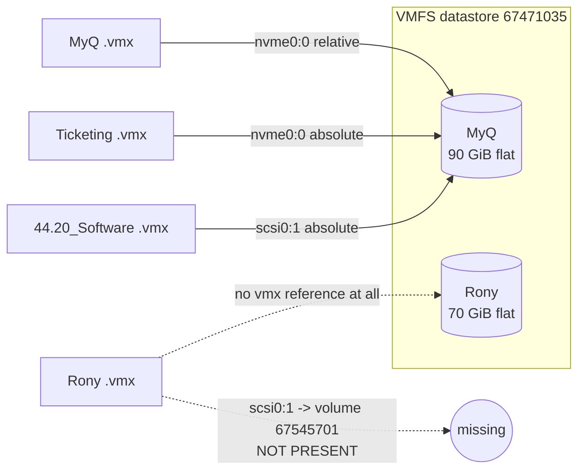
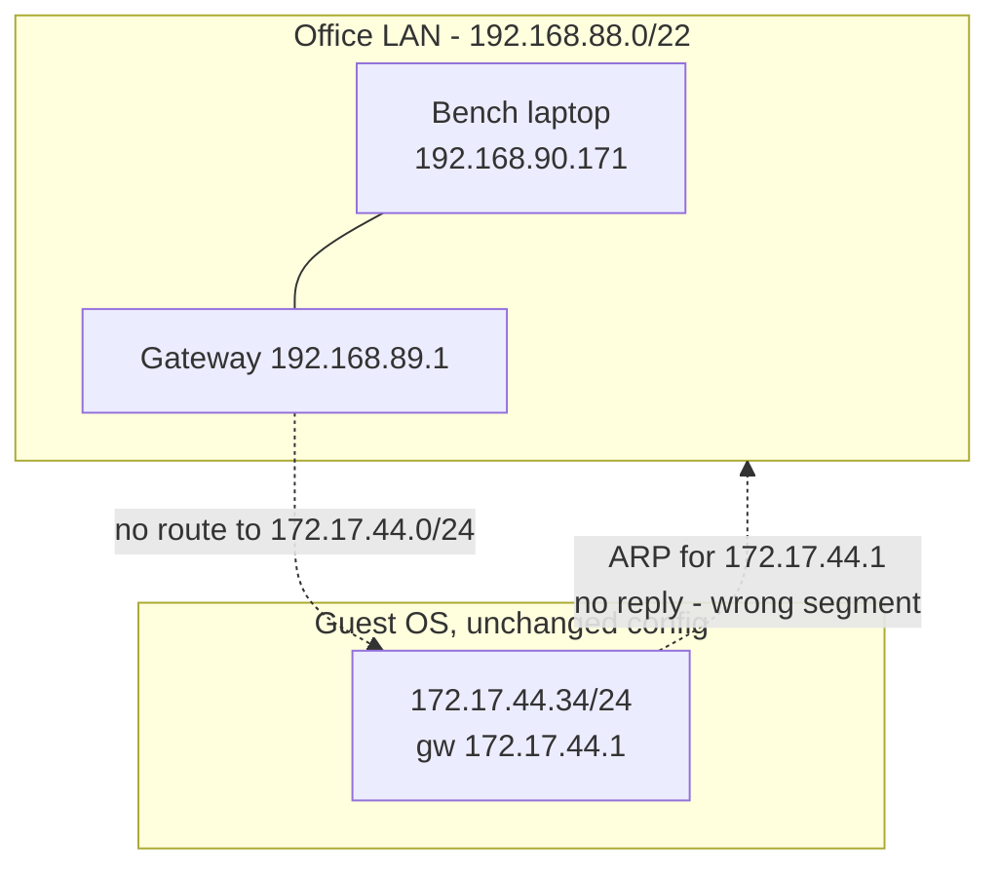
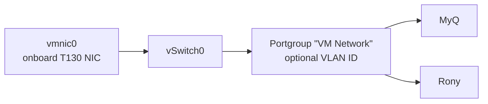
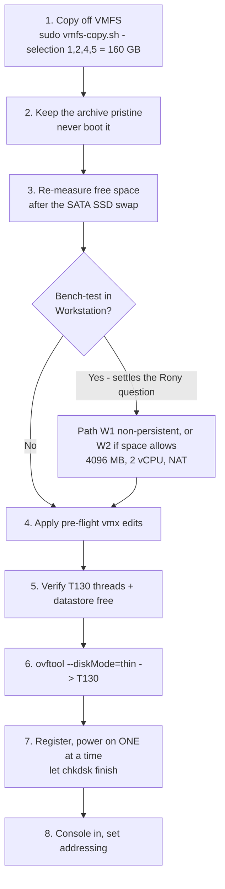

# Migrating the recovered VMFS datastore

> Companion to `README.md`. That document covers getting the data **off** the dead
> ESXi host's disk. This one covers everything after: the full VMware Workstation
> bench route (including why the network attempt failed and how to make it work),
> what booting in Workstation changes on disk, and how to land the VMs on the
> Dell T130 running ESXi 8.

---

## Contents

- [Facts, and what still needs verifying](#facts-and-what-still-needs-verifying)
- [What is actually on the datastore](#what-is-actually-on-the-datastore)
- [Space requirements](#space-requirements)
- [Part 1 - Why Workstation could not reach the office network](#part-1---why-workstation-could-not-reach-the-office-network)
- [Part 2 - Full Workstation runbook](#part-2---full-workstation-runbook)
- [Part 3 - What booting in Workstation changes on disk](#part-3---what-booting-in-workstation-changes-on-disk)
- [Part 4 - Will it still run on ESXi 8 afterwards](#part-4---will-it-still-run-on-esxi-8-afterwards)
- [Part 5 - Landing them on the T130](#part-5---landing-them-on-the-t130)
- [Recommended sequence](#recommended-sequence)
- [Command appendix](#command-appendix)
- [Summary answers](#summary-answers)

---

## Facts, and what still needs verifying

This document deliberately separates the two. Anything in the second table is a
**check to run**, not a premise to build on.

### Established

| Fact | How it was established |
|---|---|
| Source volume UUID `67471035-8c0f5fe4-2651-b42e99a8691a` | `sched.swap.derivedName` in 4 of 5 vmx files |
| All five VMs are `virtualHW.version = "20"`, `firmware = "efi"`, Secure Boot off | read from the vmx files |
| **No snapshots anywhere** - no `.vmss`, `.vmsn`, `.vmem`, no `-00000N.vmdk` chains | directory listing of all five folders |
| All folders had live `.vswp` files | so the VMs were **powered on** when storage vanished - the disks are crash-consistent |
| MyQ's disk is thin: 90 GiB apparent, 63.2 GiB allocated | allocated vs. apparent size comparison |
| Rony's `scsi0:1` points at volume `67545701-...`, which is **not on this drive**, and it has no `scsi0:0` | read from its vmx |
| Ticketing and `44.20_Software` both point at **MyQ's** vmdk and own no disk | read from their vmx files |
| The copier preserves `.nvram`, `.vmx`, `.vmdk` descriptor, `.vmsd`, `.vmxf`, scoreboards; skips `.vswp`, `-ctk.vmdk`, logs | `rsync -ahn` dry run |
| Bench laptop: i5-1155G7 4C/8T, **7.7 GB RAM**, Workstation 17.6.2, no onboard PCIe Ethernet | direct probe |
| Bench VBS/HVCI is **running** (`VirtualizationBasedSecurityStatus : 2`) | `Win32_DeviceGuard` CIM query |
| Office LAN is `192.168.88.0/22`, gw `192.168.89.1`; guests are `172.17.44.x/24`, gw `172.17.44.1` | your report |
| Target is a Dell PowerEdge T130, 4 cores, 32 GB RAM, ESXi 8 | your report |

### Must be verified before you rely on it

| Open question | How to settle it | Why it matters |
|---|---|---|
| **Does Rony's local 70 GiB disk boot?** Its own vmx never references it, and the disk it *does* reference is a `scsi0:1` on a missing volume with no `scsi0:0` at all. That layout suggests the boot disk was elsewhere and this may be a **data** disk | Attach it and try to boot; if it does not, inspect the partition table for an EFI System Partition | Decides whether you are recovering two servers, or one server plus one data volume |
| **T130 logical processor count** | `esxcli hardware cpu global get` - compare *CPU Threads* to *CPU Cores* | ESXi refuses to power on a VM with more vCPUs than the host has threads. MyQ and Ticketing are configured for 8 |
| **T130 datastore free space** | `df -h /vmfs/volumes/datastore1` | Must cover disks **plus** `.vswp` files - see the table below |
| **Does `172.17.44.0/24` still reach the T130's switch port?** | ask whoever administers the switch | Decides between "register and power on" and "reconfigure two Windows servers" |
| **Bench storage** - you are moving to a larger SATA SSD | re-measure with `Get-Volume` / `Get-PhysicalDisk` once it is in | Both the space arithmetic and the boot-time expectations below change with it |
| Whether the TP-LINK USB NIC supports promiscuous mode | try bridged mode after the Part 2.2 preparation | Decides whether bridged is possible on the bench at all |
| Whether the office switch port enforces port security / MAC limiting | ask the switch administrator | A silent, invisible cause of bridged-mode failure |

> [!IMPORTANT]
> Bench storage is being replaced with a larger SATA SSD. Everything below is therefore
> written as **requirements to satisfy**, not as arithmetic against a fixed amount of
> free space. Two things do improve materially once you are on a SATA SSD rather than a
> USB hard disk: guest boot and chkdsk stop being punishingly slow, and a persistent
> working copy becomes affordable.

## What is actually on the datastore

Five folders, but only **three disks**, and only **one VM confirmed bootable**:

| Folder | vCPU | RAM | Its disk line points at | Own `-flat.vmdk` |
|---|---|---|---|---|
| `IP_44.10_MyQ test Server` | 8 | 24576 MB | `nvme0:0` -> itself *(relative path)* | **90 GiB** apparent / 63.2 GiB allocated (thin) - **bootable** |
| `IP-42.141 Rony Site Server` | 4 | 4096 MB | `scsi0:1` -> `/vmfs/volumes/67545701-.../IP- 44.140/` - **a volume not on this drive**; no `scsi0:0` | **70 GiB** thick, **unreferenced by its own vmx - role unconfirmed** |
| `Ticketing_System_Production Server` | 8 | 24576 MB | `nvme0:0` -> **MyQ's disk** | none |
| `44.20_Software` | 1 | 8192 MB | `scsi0:1` -> **MyQ's disk**, and there is no `scsi0:0` | none |
| `IP_172.17.44.34_SQL` | - | - | - | 256 GiB *(excluded - not wanted)* |



Three consequences to carry forward:

1. **Ticketing and MyQ are the same machine.** Same disk, same 8 vCPU / 24576 MB, same
   guest OS. Ticketing's folder is 303 KB of config plus a 24 GiB swap file. Only one of
   the two can power on at a time - both Workstation and ESXi lock the vmdk, which is
   protective rather than harmful.
2. **Rony's situation is ambiguous, not merely mis-pathed.** Its vmx wants a disk on a
   volume you do not have, and it has no `scsi0:0` - so its boot disk was somewhere else
   entirely. The 70 GiB image sitting in its folder may be the OS disk under a
   configuration you have not recovered, or it may be a data volume. **Test it before
   planning around it.**
3. **No snapshots exist.** Protect that: do not create one at any point.

## Space requirements

Stated as requirements, so they hold regardless of which disk you end up using:

| Purpose | Needs |
|---|---|
| Archive from the VMFS volume *(MyQ + Rony + the two config-only folders)* | **~160 GiB** apparent. ddrescue runs without `--sparse`, so MyQ re-thickens from 63.2 GiB to its full 90 GiB |
| Optional persistent working copy for a Workstation boot test | **+70 GiB** (Rony) or **+90 GiB** (MyQ) |
| Both archive and a full second copy of both VMs | **~320 GiB** |
| T130 datastore, thick | **~180 GiB** - 70 + 90 disks, plus a 16 GiB and a 4 GiB `.vswp` |
| T130 datastore, with `ovftool --diskMode=thin` | **~153 GiB** |

Non-persistent disk mode (Part 2.5) needs **no extra space at all** - useful whenever the
working copy will not fit, and harmless when it would.

---

## Part 1 - Why Workstation could not reach the office network

Attempts made: auto bridge, manual bridge, NAT, host-only. None produced a reachable
VM. That was not a configuration mistake - **four separate conditions were in play, and
the first two are each fatal on their own.** None of them applies to the T130.

### Cause 1: the subnets are unrelated

| | Address | Mask | Gateway |
|---|---|---|---|
| Bench laptop (office LAN) | `192.168.90.171` | `255.255.252.0` -> **/22** = `192.168.88.0 - 192.168.91.255` | `192.168.89.1` |
| The VMs, as configured | `172.17.44.x` | `255.255.255.0` -> **/24** | `172.17.44.1` |

Bridged mode puts the guest NIC directly onto the host's physical segment. The VM boots,
ARPs for `172.17.44.1` on a `192.168.88.0/22` wire, and gets nothing - that gateway does
not exist there. In the other direction, no office router knows a path to
`172.17.44.34`. `172.17.44.0/24` was a network on the **old ESXi host's** side; it did
not travel with the disk.



No bridged/NAT/host-only permutation fixes this. It is a layer-3 mismatch, not a
virtualisation setting. Either the guest moves to the office subnet, or the office
brings the `172.17.44.0/24` network to the host.

### Cause 2: this laptop has no bridgeable NIC

`Get-NetAdapterBinding -ComponentID vmware_bridge` showed the bridge protocol bound to
**everything**, which is why "Automatic" behaved unpredictably:

| Adapter | What it is | Usable for bridging |
|---|---|---|
| `WiFi` - Intel Wireless-AC 9461 | 802.11 | Workstation emulates it by MAC translation. **Breaks with static IPs**, cannot carry multiple MACs |
| `Ethernet 2` - TP-LINK Gigabit **USB** | USB NIC | Only if the chipset supports promiscuous mode. Many do not - unverified here |
| `vEthernet (Default Switch)` | Hyper-V virtual | No |
| `vEthernet (WSL (Hyper-V firewall))` | Hyper-V virtual | No |
| `CloudflareWARP` | tunnel | No - and **WARP captures host routing** |
| `Tailscale` | tunnel | No |

No onboard PCIe Ethernet. Bridging over Wi-Fi and bridging over a USB NIC are the two
textbook cases where bridged mode fails, and with the protocol also bound to tunnels and
Hyper-V adapters, auto-selection had no correct choice available.

### Cause 3: VBS is running, so Workstation is in ULM mode

`VirtualizationBasedSecurityStatus : 2`, `SecurityServicesRunning : {2, 5}` - Memory
Integrity (HVCI) and kernel-mode hardware-enforced stack protection are active, so the
Windows hypervisor owns the CPU and Workstation 17.6.2 runs as a **User Level Monitor**
on top of it. Consequences: noticeably slower guests, and `vhv.enable = "TRUE"` (set on
Rony and Ticketing) **cannot work** - nested virtualisation is unavailable in ULM mode.

Leaving VBS on is fine for a boot test. Turning it off means giving up WSL2, which you
need for the copier - so if you disable it, do so **after** the copy finishes.

### Cause 4: the ghost NIC - why no IP you typed would stick

Generated MACs derive from the VM's path and UUID. Answering **"I Copied It"** at
Workstation's move/copy prompt regenerates `uuid.bios` and the MAC. Windows then
enumerates a **new** adapter, and the old `172.17.44.34` configuration stays bound to a
hidden, non-present device. The new NIC comes up with nothing, and anything typed into
the GUI is either ignored or silently conflicts with the invisible one.

This alone would make every networking mode look broken.

---

## Part 2 - Full Workstation runbook

Workstation is a reasonable place to prove these disks boot before you carry them to the
T130 - and it is the fastest way to settle the open question about Rony's disk. Here is
the complete route.

### 2.0 Bench constraints

| Constraint | Value | Consequence |
|---|---|---|
| Host RAM | **7.7 GB** - measured | Give a guest **4096 MB** max, 2 vCPU. MyQ's configured 24576 MB is impossible here |
| VBS | **On** - measured | ULM mode: slower guests, and `vhv.enable` must be set `FALSE` |
| Free space | **re-measure after the SSD swap** | Decides Path W1 vs W2 below |
| Disk media | **re-check after the SSD swap** | On a SATA SSD, boot and chkdsk run at normal speed. On a USB hard disk, 4K random I/O is around 1 MB/s and a chkdsk pass over 90 GB can run for hours |

```powershell
# Re-measure once the SATA SSD is installed - do not carry old numbers forward
Get-Volume | Where-Object DriveLetter |
  Select-Object DriveLetter,
    @{n='TotalGB';e={[math]::Round($_.Size/1GB,1)}},
    @{n='FreeGB'; e={[math]::Round($_.SizeRemaining/1GB,1)}}
Get-PhysicalDisk | Select-Object DeviceId, FriendlyName, MediaType, BusType,
    @{n='SizeGB';e={[math]::Round($_.Size/1GB,1)}}
```

### 2.1 Choose a path

| | **Path W1 - verify only** | **Path W2 - stage and ship** |
|---|---|---|
| Disk mode | Independent **non-persistent** | Normal persistent, on a **copy** |
| Extra disk space | **None** | +70 GiB (Rony) / +90 GiB (MyQ) |
| Archive stays bit-identical? | **Yes** | Yes - you boot the copy, not the archive |
| Can fix the guest IP, uninstall Tools? | No - writes are discarded at power-off | **Yes** |
| Can perform a clean shutdown? | No | **Yes** |
| Good for | *Does this disk boot?* - including the Rony question | Converting a crash-consistent disk into a cleanly closed one |

**Rule:** if the measured free space does not comfortably exceed the archive plus the
working copy from the requirements table, use **W1**. It costs nothing and answers the
question that matters most right now.

### 2.2 Prepare the host (once)

```powershell
# Strip the bridge protocol off every adapter that must never be bridged
'vEthernet (Default Switch)','vEthernet (WSL (Hyper-V firewall))',
'CloudflareWARP','Tailscale','WiFi' | ForEach-Object {
  Disable-NetAdapterBinding -Name $_ -ComponentID vmware_bridge -Confirm:$false
}
Get-NetAdapterBinding -ComponentID vmware_bridge | Select-Object Name, Enabled
```

Then disconnect Cloudflare WARP while testing - it captures host routing and will
interfere with both bridged and NAT.

If you intend to bridge, open **Edit -> Virtual Network Editor -> Change Settings**
(needs elevation) and set **VMnet0 -> Bridged to: `Ethernet 2`** explicitly. Never leave
it on *Automatic*.

### 2.3 Pre-edit the `.vmx` before opening it

Do this on the copy, never the source.

```ini
# --- required: the ISO lives on volume 6410a09e, which no longer exists ---
sata0:0.deviceType     = "atapi-cdrom"
sata0:0.fileName       = "auto detect"
sata0:0.startConnected = "FALSE"

# --- Rony only: point it at the local 70 GiB disk so there is something to test ---
scsi0:1.fileName = "IP-42.141 Rony Site Server.vmdk"

# --- required on this bench: fit 7.7 GB of RAM and 4 cores ---
numvcpus             = "2"
memSize              = "4096"
cpuid.coresPerSocket = "1"     # Ticketing ships as "4" - invalid once numvcpus < 4
vhv.enable           = "FALSE" # cannot work under ULM mode

# --- networking: start on NAT, it always works ---
ethernet0.connectionType = "nat"
ethernet0.vnet           = "VMnet8"

# --- delete outright, all baked to the dead host ---
#   numa.autosize.cookie
#   numa.autosize.vcpu.maxPerVirtualNode
#   migrate.hostLog
#   sched.swap.derivedName
```

Do **not** change `virtualHW.version`. Leave it at `20`.

If Rony's disk will not boot from `scsi0:1`, try it as `scsi0:0` before concluding the
image is not an OS disk - the controller node it is presented on can matter to firmware.

If Workstation refuses the disk outright, the descriptor needs one edit - change
`createType="vmfs"` to `createType="monolithicFlat"`, and
`RW 146800640 VMFS "IP-42.141 Rony Site Server-flat.vmdk"` to
`RW 146800640 FLAT "IP-42.141 Rony Site Server-flat.vmdk" 0` (note the trailing offset).
ESXi needs no such edit, so keep this change on the bench copy only.

### 2.4 Open it, and answer the prompt correctly

**File -> Open** the `.vmx`. Two prompts follow:

| Prompt | Answer | Why |
|---|---|---|
| "This VM may have been moved or copied" | **I Moved It** | Preserves `uuid.bios` (Windows activation) and the original MAC - `00:0c:29:e6:0d:83` (MyQ), `00:0c:29:05:7f:b1` (Rony), `00:0c:29:7c:48:5e` (Ticketing). Prevents the ghost-NIC problem entirely |
| "Upgrade this virtual machine?" | **Decline / Keep as is** | Accepting takes HW 20 -> 21. ESXi 8 runs 21 fine, but there is no benefit and it removes your fallback to any 7.x host |

### 2.5 Path W1 only - make the disk non-persistent

**VM Settings -> Hard Disk -> Advanced -> Independent -> Non-persistent.**

Every guest write now lands in a redo log that is discarded at power-off. The base
`-flat.vmdk` is never modified, so the archive stays bit-identical to what came off the
VMFS volume, and you need no second copy.

### 2.6 Boot, and set expectations

Power on. These VMs were **powered on when the storage vanished**, so the filesystems are
crash-consistent and the first boot will be dirty.

| Stage | On a SATA SSD | On a USB hard disk |
|---|---|---|
| POST to Windows logo | under a minute | 1-3 min |
| Dirty-shutdown detection / chkdsk | minutes | **minutes to hours** - do not interrupt it |
| First login | a few minutes | 15-40 min from power-on |
| Services settling | a few minutes | another 5-15 min - databases run their own crash recovery |

`bad areas: 0` in the ddrescue output means the image is clean; any in-guest damage is
from the unclean shutdown, not the copy.

### 2.7 Networking - the complete matrix

| Mode | Reachable from office LAN | Guest keeps `172.17.44.x` | Works on this laptop |
|---|---|---|---|
| **NAT** (VMnet8) | Only via **port forwarding** | No - gets a VMnet8 address | **Always** |
| Bridged -> `Ethernet 2` (USB) | Yes, if the chipset does promiscuous mode | No - must re-address to `192.168.90.x` | Unverified |
| Bridged -> `WiFi` | Partially, via MAC translation | No, and static IPs break | Unreliable |
| **LAN Segment** (isolated) | No | **Yes - original addressing works** | Yes |
| Host-only (VMnet1) | No | No | Yes, but not useful here |

**The trick worth knowing: use two NICs.** Add a second adapter so the VM has both:

- `ethernet0` on **NAT** -> outbound internet, plus inbound via port forwarding
- `ethernet1` on a **LAN Segment** -> keep `172.17.44.34/24` exactly as configured

That lets you validate inter-VM communication on the original subnet (useful if MyQ
expects to reach a server at `172.17.44.x`) while still having usable connectivity from
the host. Nothing on the office LAN is involved, so nothing can conflict.

**NAT plus port forwarding** - the only approach I would rely on for office
reachability from this laptop:

1. **Edit -> Virtual Network Editor -> VMnet8 -> NAT Settings -> Port Forwarding**
2. Add: host port `3389` -> guest IP, guest port `3389` (RDP). Or `443` -> the MyQ web port
3. Allow the port inbound in **Windows Firewall on the laptop**
4. Allow the service in the **guest** firewall
5. Colleagues connect to `192.168.90.171:3389`

**If you insist on bridged**, and it still fails after binding VMnet0 explicitly to
`Ethernet 2`, the remaining suspects are:

- The TP-LINK USB chipset does not support promiscuous mode - unfixable, use NAT
- **The office switch port has port security / MAC limiting.** A bridged VM presents a
  second MAC on the same port; a managed switch configured for one MAC per port will
  drop it silently. Ask whoever runs the switch. This is a common and invisible cause
- WARP or Tailscale still active and capturing routes

**Re-addressing the guest to the office subnet**, if you go the bridged route - first
clear the ghost adapter inside the guest:

```bat
set devmgr_show_nonpresent_devices=1
devmgmt.msc
:: View -> Show hidden devices -> Network adapters -> remove the greyed-out NIC
```

Then on the live adapter:

```
IP       192.168.90.200      (any free address outside the DHCP scope)
Mask     255.255.252.0
Gateway  192.168.89.1
DNS      your office resolvers
```

### 2.8 Path W2 only - clean up and hand off

While the guest is up:

1. Let chkdsk finish completely.
2. Remove the ghost NIC and set whichever addressing you decided on.
3. Uninstall the old VMware Tools (ESXi 8 will want a newer build anyway).
4. Confirm the application services start.
5. **Shut down cleanly from inside Windows.** This is the real prize - it converts a
   crash-consistent disk into a properly closed one.

Then, before shipping to the T130: confirm no snapshot was created, delete any `.lck`
directories Workstation left behind, confirm no `.vmss`/`.vmem` suspend state exists, and
reset `memSize` / `numvcpus` to the T130 values from Part 5. Commands in the appendix.

---

## Part 3 - What booting in Workstation changes on disk

**It does change things.** Most is cosmetic, one item matters for a recovery, and two
are avoidable footguns.

| Artefact | What happens | Severity |
|---|---|---|
| **`-flat.vmdk`** | **Written to** *(unless the disk is non-persistent)*. Windows writes the pagefile, event logs, registry hives, the NTFS journal, chkdsk repairs, possibly Windows Update | **High** - the image stops being byte-identical to what came off the VMFS volume |
| **`virtualHW.version`** | Workstation offers to upgrade, taking it **20 -> 21** | **Medium** - ESXi 8 runs HW 21, so not fatal for you. Still decline: no benefit, and it removes your fallback to 7.x |
| **Snapshots** | Only if you take one - creates `-00000N.vmdk` delta disks | **High** - manufactures the delta chain these disks currently do not have. Do not take one |
| `.vmem` / `.vmss` | Created only if you **suspend** | Medium - discard before migrating; saved CPU state does not survive a host change |
| `uuid.bios`, `uuid.location`, `ethernet0.generatedAddress` | **Regenerated if you answer "I Copied It"** | Medium - Windows may want reactivation, and the ghost NIC appears |
| `.nvram` | Rewritten - the guest updates EFI variables every boot | Low - remains a valid EFI boot config, but it is modified |
| `.vmx` | Rewritten. Gains Workstation keys (`tools.syncTime`, `sound.*`, `usb.*`, `mks.*`, `vmci0.*`, `hgfs.*`, `isolation.tools.*`, `gui.*`, `ethernet0.connectionType`, `ethernet0.vnet`). ESXi-only keys such as `sched.swap.derivedName` and `migrate.hostLog` are dropped | Low - ESXi ignores keys it does not recognise |
| `.vmdk` descriptor | May be rewritten - Workstation prefers `createType="monolithicFlat"` with `FLAT ... 0` | Low - metadata only; ESXi rewrites it on import |
| `.vmx.lck/`, `<disk>.lck/` | Lock **directories** created while running; normally removed on clean shutdown, left behind after a crash | Low - delete before uploading |
| `vmware.log`, `.vmxf`, `.vmsd` | Written / rotated / updated | None |
| `vm*.scoreboard` | ESXi-specific; Workstation ignores them | None |

### The two rules

1. **Never boot the archive copy.** Keep the copier's output pristine and never-booted.
   Boot a working copy, or use non-persistent mode.
2. **Take no snapshots, and decline the hardware-version upgrade.**

---

## Part 4 - Will it still run on ESXi 8 afterwards?

**Yes.** On ESXi 8 specifically, most of the classic worries evaporate:

| Concern | Status on your T130 |
|---|---|
| `virtualHW.version = "20"` | **Native.** ESXi 8 runs HW 20 and 21 - no conversion, no OVF round-trip strictly required |
| `firmware = "efi"`, Secure Boot off | Supported directly |
| Workstation-added vmx keys | Ignored by ESXi |
| Snapshots | None exist - keep it that way |
| `.lck` directories | Delete before upload if Workstation left any |
| Disk format | Unchanged unless you explicitly convert. Keep a single flat extent |

The `.nvram` matters more than people expect: with `firmware = "efi"`, the EFI boot entry
that points at the Windows bootloader lives in that file. The copier does preserve it
(270,840 bytes). Lose it and you get *no operating system found* and a manual boot-entry
rebuild in the EFI shell.

---

## Part 5 - Landing them on the T130

### 5.1 Verify thread count first - it decides whether 8 vCPU is possible

**ESXi refuses to power on a VM with more vCPUs than the host has logical processors.**
"4 cores" does not settle this - the T130 shipped with CPUs that differ exactly here:

| T130 CPU option | Cores / Threads | 8-vCPU VM? |
|---|---|---|
| Xeon E3-1220 v5/v6, E3-1225 v5/v6 | 4C / **4T** (no HT) | **Will not power on** |
| Xeon E3-1230 v5/v6, E3-1240 v5/v6, E3-1270 v6 | 4C / **8T** | Powers on, but starves the host |
| Core i3-6100 | 2C / 4T | No |

```sh
esxcli hardware cpu global get     # compare "CPU Threads" against "CPU Cores"
```

If it reports 4 threads, MyQ and Ticketing (`numvcpus = "8"`) must come down before
first power-on. Mind the trap: **Ticketing ships with `cpuid.coresPerSocket = "4"`** -
set `numvcpus = "2"` and leave that at 4, and power-on fails with an invalid-topology
error. Set `coresPerSocket = "1"`. Two vCPU is ample for these workloads.

### 5.2 RAM budget on 32 GB

ESXi 8 has a heavier footprint than 6.x - reserve roughly **6 GB** for the hypervisor
and its agents, leaving ~26 GB for guests.

| Plan | MyQ | Rony | Total | Verdict |
|---|---|---|---|---|
| As configured | 24576 MB | 4096 MB | 28 GB | **Over budget** - ballooning and host swap |
| **Recommended** | **16384 MB** | 4096 MB | 20 GB | ~6 GB headroom, comfortable |
| Minimum | 8192 MB | 3072 MB | 11 GB | Plenty of room, fine for validation |

Ticketing and `44.20_Software` share MyQ's disk, so they can never run beside it - your
real concurrent load is MyQ plus Rony only.

### 5.3 Storage budget - do not forget the swap files

Each powered-on VM creates a `.vswp` equal to `memSize` minus any memory reservation.
That is real datastore space, on top of the disks:

| Item | Thick | With `--diskMode=thin` |
|---|---|---|
| Rony disk | 70 GiB | 70 GiB *(already thick)* |
| MyQ disk | 90 GiB | ~63 GiB |
| MyQ `.vswp` @ 16 GB | 16 GiB | 16 GiB |
| Rony `.vswp` @ 4 GB | 4 GiB | 4 GiB |
| **Total free needed** | **~180 GiB** | **~153 GiB** |

```sh
df -h /vmfs/volumes/datastore1
```

### 5.4 Networking - the decision that actually matters

On ESXi this is straightforward, and the laptop's bridging problem does not exist here -
the T130 has real onboard server NICs feeding a vSwitch, which is bridging done properly.



All four VMs specify `ethernet0.networkName = "VM Network"` - the ESXi default portgroup.
Confirm it exists and that its vSwitch has a live uplink.

The real question is **which network the T130's uplink sits on**:

| Situation | What to do | Guest changes |
|---|---|---|
| `172.17.44.0/24` still exists and reaches the T130 | Put the uplink on it, or set the portgroup's **VLAN ID** if the switch port is a trunk | **None.** The VMs keep `172.17.44.x` and simply work |
| Only `192.168.88.0/22` is available | Re-address each guest: `192.168.90.xxx` / `255.255.252.0` / gw `192.168.89.1` | Console in and set the static IP |

Aim for the first row - it is the difference between "register and power on" and
"reconfigure two Windows servers". Ask whoever runs the switch whether
`172.17.44.0/24` is still trunked to the port the T130 will use.

Expect MACs to change on import regardless (`addressType = "generated"`), so plan on
**console access** rather than expecting the servers to appear on the network by
themselves.

### 5.5 Getting ~160 GB onto the host

| Method | Notes |
|---|---|
| **`ovftool`** *(recommended)* | Already installed with Workstation. `--diskMode=thin` re-thins MyQ during transfer, reclaiming ~27 GiB, and it builds a **fresh vmx** on the target - so the stale ISO paths, `numa.autosize.*`, `migrate.hostLog` and Rony's broken `scsi0:1` are all resolved on import instead of by hand. Never writes to the source |
| `scp` over SSH | Enable SSH (Host Client -> Manage -> Services -> TSM-SSH -> Start), copy to `/vmfs/volumes/datastore1/`, then **Register VM**. Simple and reliable, but hand-edit the vmx first |
| Host Client datastore upload | Works, but flaky for a single 90 GB file. Avoid |

Over gigabit, expect roughly 45-60 minutes for the pair, assuming the source disk can
sustain it.

### 5.6 On the host, after import

| Item | Note |
|---|---|
| Activation | Registering the copied vmx preserves `uuid.bios`; building a fresh VM does not. The source ISO was `SERVER_EVAL` - 180-day evaluation licences |
| Shared disk | Ticketing and `44.20_Software` both point at MyQ's vmdk. Power on **only one at a time**; never enable multi-writer |
| First boot | Dirty. Let chkdsk and any database recovery finish |
| VMware Tools | Installed but old. ESXi 8 will flag it - cosmetic, upgrade once stable |
| Confirmed bootable | **MyQ.** Rony is unconfirmed; Ticketing and `44.20_Software` are config shells with no disk of their own |
| `vhv.enable` | Works on the T130 if VT-x is enabled in BIOS. Leave it unless power-on complains |

---

## Recommended sequence



1. **Copy** - `sudo ./vmfs-copy.sh --src /mnt/vmfs --dest /mnt/d`, selection `1,2,4,5`
   (160 GB). Do **not** pick `all` - 416 GB fails the space check.
2. **Keep the archive pristine.** Never boot it directly.
3. **Re-measure** free space and media type once the SATA SSD is in.
4. **Bench-test if you want** - and there is a concrete reason to: it is the cheapest way
   to find out whether Rony's 70 GiB disk is a bootable OS volume. Answer
   **"I Moved It"**, decline the HW upgrade, start on NAT.
5. **Verify the T130** - `esxcli hardware cpu global get` for thread count, and datastore
   free space against the ~153-180 GiB table.
6. **Push with `ovftool --diskMode=thin`.**
7. **Power on one at a time.** First boot is dirty; let recovery finish uninterrupted.
8. **Console in and set addressing** - unless `172.17.44.0/24` reaches the T130, in which
   case there is nothing to change.

---

## Command appendix

```powershell
# --- bench: re-measure storage after the SATA SSD swap ---
Get-Volume | Where-Object DriveLetter | Select-Object DriveLetter, Size, SizeRemaining
Get-PhysicalDisk | Select-Object DeviceId, FriendlyName, MediaType, BusType, Size

# --- bench: strip bridge bindings from adapters that must never be bridged ---
'vEthernet (Default Switch)','vEthernet (WSL (Hyper-V firewall))',
'CloudflareWARP','Tailscale','WiFi' | ForEach-Object {
  Disable-NetAdapterBinding -Name $_ -ComponentID vmware_bridge -Confirm:$false
}

# --- bench: confirm nothing was left behind before shipping ---
$vm = 'D:\IP_44.10_MyQ test Server'                    # adjust per VM
Get-ChildItem $vm -Include *.vmss,*.vmem -Recurse      # must be empty
Get-ChildItem $vm -Filter '*-00000*.vmdk'              # must be empty - no snapshots
Get-ChildItem $vm -Directory -Filter '*.lck' | Remove-Item -Recurse -Force

# --- transfer to the T130, re-thinning MyQ on the way in ---
& "C:\Program Files (x86)\VMware\VMware Workstation\OVFTool\ovftool.exe" `
  --acceptAllEulas --noSSLVerify --diskMode=thin --name="IP_44.10_MyQ" `
  "D:\IP_44.10_MyQ test Server\IP_44.10_MyQ test Server.vmx" `
  "vi://root@T130-IP/?dcPath=ha-datacenter&dsName=datastore1"
```

```sh
# --- on the T130 ---
esxcli hardware cpu global get                    # threads vs cores
df -h /vmfs/volumes/datastore1                    # free space incl. room for .vswp
esxcli network vswitch standard list              # uplinks and portgroups

# register a folder copied by scp rather than ovftool
vim-cmd solo/registervm "/vmfs/volumes/datastore1/IP_44.10_MyQ test Server/IP_44.10_MyQ test Server.vmx"
vim-cmd vmsvc/getallvms
vim-cmd vmsvc/power.on <Vmid>

# re-thin a thick disk in place if it arrived via scp
vmkfstools -i "SRC.vmdk" "DST.vmdk" -d thin
```

```bat
:: --- inside the guest: clear the ghost NIC holding the old static IP ---
set devmgr_show_nonpresent_devices=1
devmgmt.msc
:: View -> Show hidden devices -> Network adapters -> remove the greyed-out NIC
```

---

## Summary answers

**Can I run these in Workstation again?** Yes, and Part 2 is the full runbook. It boots
fine. What it cannot do from this laptop is put the VMs on the office network - the
guests are on `172.17.44.0/24`, the office is `192.168.88.0/22`, and the only NICs
available are Wi-Fi and a USB adapter, neither reliably bridgeable. Use **NAT with port
forwarding** for reachability, or a **LAN Segment** if you want the guests to keep their
original addresses and talk to each other. At 7.7 GB of RAM, cap guests at 4096 MB and
2 vCPU. **None of these constraints apply to the T130.**

**Snapshot the Windows and restore into a new VM?** No. A VMware snapshot is a delta disk
that only means anything beside its parent - it transports nothing, and creating one
manufactures the delta chain these disks luckily do not have. Imaging the guest and
restoring into a fresh VM is possible, but it is far more work, loses `uuid.bios`, and
adds UEFI bootloader repair to the job. Use `ovftool` instead.

**Does Workstation change the file structure?** Yes - `-flat.vmdk` is written to,
`.nvram` and `.vmx` are rewritten, `.lck` directories appear. Set the disk to
**independent non-persistent** and none of it touches your archive. Either way, ESXi 8
still runs the VM afterwards as long as you take no snapshots and decline the HW upgrade.

**Will it run on ESXi 8?** Yes, directly - HW 20 is native to ESXi 8, so no conversion is
required. The constraints to verify are the T130's **thread count** (decides whether
8 vCPU is even possible), its **32 GB of RAM** (drop MyQ to 16 GB), and **~180 GiB of
datastore** including swap files.

**Best route?** Copy off the VMFS volume, keep that copy pristine, apply the pre-flight
vmx edits, and push to the T130 with `ovftool --diskMode=thin`. Bench-boot in Workstation
first if you want proof it starts - and do it at least for Rony, because whether its
70 GiB disk is bootable at all is still an open question.
