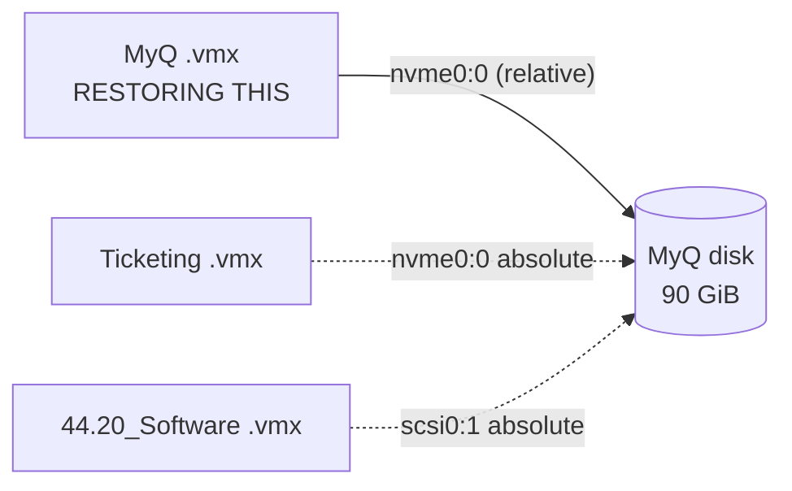
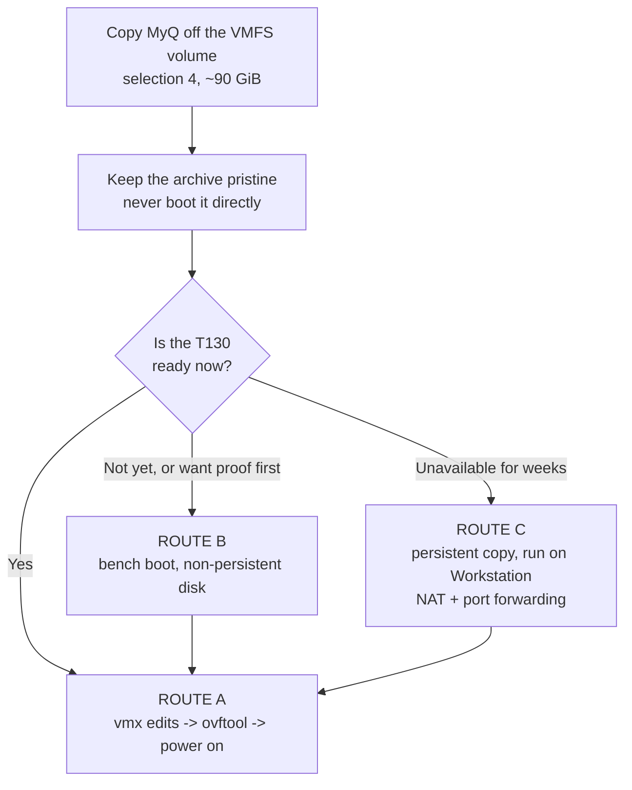
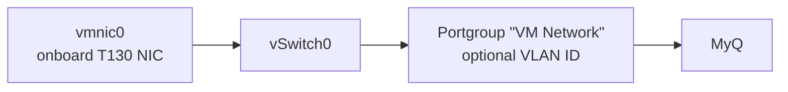
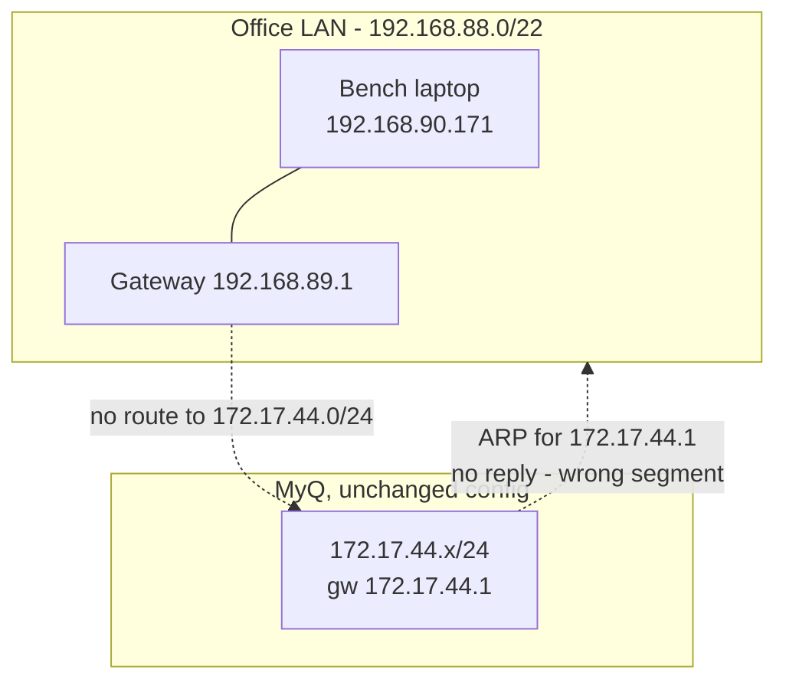
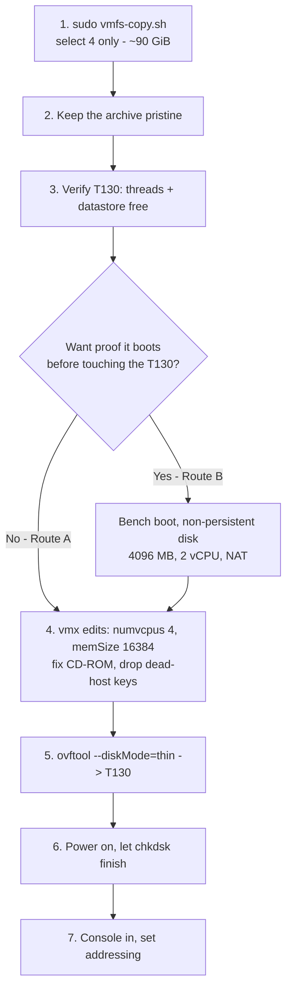

# Restoring the MyQ server

> Companion to `README.md`. That document covers getting the data **off** the dead
> ESXi host's disk. This one covers what happens after: which route to take, the full
> VMware Workstation procedure, and how to land MyQ on the Dell PowerEdge T130
> running ESXi 8.

**Scope: MyQ only.** One VM, one 90 GiB disk. Everything below is sized for that.

---

## Contents

- [Scope - and why nothing else is being restored](#scope---and-why-nothing-else-is-being-restored)
- [What MyQ actually is](#what-myq-actually-is)
- [Strategy - which route to take](#strategy---which-route-to-take)
- [Space requirements](#space-requirements)
- [Part 1 - ESXi 8 on the T130 (primary route)](#part-1---esxi-8-on-the-t130-primary-route)
- [Part 2 - VMware Workstation (rehearsal or fallback)](#part-2---vmware-workstation-rehearsal-or-fallback)
- [Part 3 - What a Workstation boot changes on disk](#part-3---what-a-workstation-boot-changes-on-disk)
- [Recommended sequence](#recommended-sequence)
- [Command appendix](#command-appendix)
- [Summary answers](#summary-answers)

---

## Scope - and why nothing else is being restored

The datastore holds five folders, but they are not five servers. Only **three disk
images** exist, and only **one of them belongs to a complete, self-contained machine**.

| Folder | Restore? | Why |
|---|---|---|
| **`IP_44.10_MyQ test Server`** | **Yes** | `nvme0:0` points at its own disk by relative path. Self-contained - nothing outside its folder is needed |
| `Ticketing_System_Production Server` | No | Its `nvme0:0` is an **absolute path to MyQ's vmdk**. It owns no disk - just 303 KB of config plus a 24 GiB swap file |
| `44.20_Software` | No | Same: `scsi0:1` points at **MyQ's vmdk**, and there is no `scsi0:0` at all |
| `IP-42.141 Rony Site Server` | No | Its `scsi0:1` points at a volume that is **not on this drive**, and it has no `scsi0:0`. The 70 GiB image in its folder is referenced by nothing, so its role is unconfirmed |
| `IP_172.17.44.34_SQL` | No | 256 GiB, not wanted |



> [!NOTE]
> Ticketing and `44.20_Software` are not additional servers you are leaving behind -
> they are alternate configurations pointing at **the same disk you are restoring**.
> Whatever those machines were, the data is in MyQ's vmdk. Only one of the three can
> ever power on at a time anyway, because both Workstation and ESXi lock the vmdk.

## What MyQ actually is

| Property | Value |
|---|---|
| Display name in the inventory | `IP_44.10_RND_MOST_Inportand Do shutdown` - **not** "MyQ" |
| Disk | `nvme0:0`, thin: **90 GiB apparent / 63.2 GiB allocated** |
| vCPU / RAM as configured | **8** / **24576 MB** |
| Hardware version | `20` (ESXi 7.0 U2) - **runs natively on ESXi 8** |
| Firmware | `efi`, Secure Boot not set (off) |
| NIC | `e1000e`, MAC `00:0c:29:e6:0d:83`, portgroup `VM Network` |
| `cpuid.coresPerSocket` | `1` |
| `vhv.enable` | **not set** - so nested virtualisation is not a factor for this VM |
| CD-ROM | points at an ISO on volume `6410a09e-...`, **which no longer exists** |
| Snapshots | **none** - no `.vmss`, `.vmsn`, `.vmem`, no `-00000N.vmdk` delta chain |
| State at failure | `.vswp` files were live, so it was **powered on** when storage vanished |

Two things follow from that last row, and they set expectations for the first boot:

- The filesystem is **crash-consistent, not cleanly shut down.** Expect chkdsk and any
  database to run its own recovery on first power-on. That is normal, not damage.
- `bad areas: 0` from ddrescue means the *image* is clean. Anything you see in the guest
  comes from the unclean shutdown, not from the copy.

The copier brings across the files ESXi needs and skips the ones it does not
(verified by `rsync -ahn` dry run): `.nvram` (270,840 bytes - **the EFI boot entry
lives here**), `.vmx` (3,189), the `.vmdk` descriptor (466), `.vmsd`, `.vmxf`, and four
`vm*.scoreboard` files. It skips 11 `vmware*.log` files and both `.vswp` files, which
ESXi recreates.

### Still to verify

| Check | Command | Why it matters |
|---|---|---|
| **T130 logical processor count** | `esxcli hardware cpu global get` | ESXi refuses to power on a VM with more vCPUs than the host has threads. MyQ is configured for **8** |
| **T130 datastore free space** | `df -h /vmfs/volumes/datastore1` | Must cover the disk **plus** the `.vswp` file |
| **Does `172.17.44.0/24` reach the T130's switch port?** | ask whoever runs the switch | Decides between "power on and done" and "console in and re-address" |
| **Bench free space and media type** | `Get-Volume` / `Get-PhysicalDisk` | You are moving to a larger SATA SSD - re-measure rather than reusing old figures |

## Space requirements

Stated as requirements, so they hold whichever disk you end up using:

| Purpose | Needs |
|---|---|
| Archive MyQ off the VMFS volume | **~90 GiB.** ddrescue runs without `--sparse`, so the disk re-thickens from 63.2 GiB to its full 90 GiB |
| Add a persistent working copy for a Workstation boot test | **+90 GiB** (~180 GiB total) |
| Workstation test with a **non-persistent** disk | **no extra space at all** |
| T130 datastore, thick, MyQ at 16 GB RAM | **~106 GiB** (90 disk + 16 GiB `.vswp`) |
| T130 datastore, `--diskMode=thin`, MyQ at 16 GB RAM | **~79 GiB** (63 disk + 16 GiB `.vswp`) |
| T130 datastore if you keep MyQ at 24576 MB | add 8 GiB to either figure - the `.vswp` grows with `memSize` |

In the copier's menu the folders are listed **sorted by name**, so MyQ is entry **`4`**:

```
1  44.20_Software
2  IP-42.141 Rony Site Server
3  IP_172.17.44.34_SQL
4  IP_44.10_MyQ test Server      <- select this one
5  Ticketing_System_Production Server
```

Select `4` and nothing else. The SIZE column shows **apparent** bytes, so MyQ reads
~90 GiB and the space check will demand that much free. Confirm the name on screen
before pressing Enter.

---

## Strategy - which route to take

You asked which is best. With MyQ alone in scope, the answer is clearer than it would
be for a multi-VM recovery, because **MyQ is self-contained** - its vmx references its
own disk by relative path, so there is nothing to reconstruct.

| | **Route A - straight to the T130** | **Route B - Workstation rehearsal first** | **Route C - Workstation as interim production** |
|---|---|---|---|
| **Recommended** | **Yes** | If the T130 is not ready, or you want proof before scheduling downtime | Only if the T130 will be unavailable for a while |
| Steps | copy -> vmx edits -> `ovftool` -> power on | copy -> bench boot -> vmx edits -> `ovftool` -> power on | copy -> working copy -> bench boot -> run it there |
| Extra disk space | none | none, with a non-persistent disk | **+90 GiB** for a persistent copy |
| Archive mutated | never | never | never (you boot the copy) |
| Where the dirty first boot happens | T130's server storage - **fastest** | bench disk, then again on the T130 | bench disk |
| Reachable on the office network | **yes**, natively | not tested there | **only via NAT port forwarding** - see 2.7 |
| Time cost | lowest | a few hours more | ongoing |

**Route A is the recommendation.** ESXi 8 runs hardware version 20 natively, so there is
no conversion step, no OVF round-trip forced on you, and no format change. The dirty
first boot then happens once, on real server storage, rather than twice.

**Take Route B if you want certainty before you travel** - it is genuinely cheap. With
the disk set to *independent non-persistent* it costs no extra space and cannot touch
the archive, and it answers "does this image boot at all" before you book downtime on
the T130.

**Route C is a last resort.** Workstation runs MyQ fine, but putting it on the office
network from this laptop is the hard part - the guest is on `172.17.44.0/24`, the office
is `192.168.88.0/22`, and the only NICs available are Wi-Fi and a USB adapter. NAT with
port forwarding works; nothing else reliably does. Details in 2.7.



---

## Part 1 - ESXi 8 on the T130 (primary route)

### 1.1 Verify thread count first - it decides whether 8 vCPU is possible

**ESXi refuses to power on a VM with more vCPUs than the host has logical processors.**
"4 cores" does not settle this - the T130 shipped with CPUs that differ exactly here:

| T130 CPU option | Cores / Threads | MyQ at 8 vCPU? |
|---|---|---|
| Xeon E3-1220 v5/v6, E3-1225 v5/v6 | 4C / **4T** (no HT) | **Will not power on** |
| Xeon E3-1230 v5/v6, E3-1240 v5/v6, E3-1270 v6 | 4C / **8T** | Powers on, but leaves nothing for the host |
| Core i3-6100 | 2C / 4T | No |

```sh
esxcli hardware cpu global get     # compare "CPU Threads" against "CPU Cores"
```

**Set `numvcpus = "4"` regardless of what it reports.** Four is safe on either CPU and
leaves the hypervisor room to schedule; eight on a four-core host produces co-stop
stalls even when it is permitted. `cpuid.coresPerSocket` must divide evenly into
`numvcpus`, so pair `numvcpus = "4"` with `coresPerSocket = "4"` (one socket, four
cores) or leave it at `1`. Both are valid; `4` is tidier.

### 1.2 RAM budget on 32 GB

Reserve roughly **6 GB** for ESXi 8 and its agents, leaving ~26 GB for guests. With MyQ
as the only VM, its configured 24576 MB does technically fit - but only just.

| Setting | Guest | Host headroom | `.vswp` on datastore | Verdict |
|---|---|---|---|---|
| As configured: 24576 MB | 24 GB | ~2 GB | 24 GiB | Works, but no room for a second VM ever, and a tight host |
| **Recommended: 16384 MB** | 16 GB | ~10 GB | 16 GiB | Comfortable, and leaves room to grow |
| Minimum: 8192 MB | 8 GB | ~18 GB | 8 GiB | Fine for validating the restore |

Start at **16384**. Raise it later if the application actually needs more - that is a
one-line vmx change and a reboot, whereas a starved host is harder to diagnose.

### 1.3 Storage budget - do not forget the swap file

A powered-on VM creates a `.vswp` equal to `memSize` minus any memory reservation. That
is real datastore space, on top of the disk:

| Item | Thick | With `--diskMode=thin` |
|---|---|---|
| MyQ disk | 90 GiB | ~63 GiB |
| `.vswp` at 16 GB RAM | 16 GiB | 16 GiB |
| **Total free needed** | **~106 GiB** | **~79 GiB** |

```sh
df -h /vmfs/volumes/datastore1
```

### 1.4 Networking

On ESXi this is straightforward, and the laptop's bridging problem does not exist here -
the T130 has real onboard server NICs feeding a vSwitch, which is bridging done properly.



MyQ specifies `ethernet0.networkName = "VM Network"` - the ESXi default portgroup.
Confirm it exists and that its vSwitch has a live uplink. The real question is which
network that uplink sits on:

| Situation | What to do | Guest changes |
|---|---|---|
| `172.17.44.0/24` still reaches the T130 | Put the uplink on it, or set the portgroup's **VLAN ID** if the switch port is a trunk | **None.** MyQ keeps its address and simply works |
| Only `192.168.88.0/22` is available | Re-address the guest: `192.168.90.xxx` / `255.255.252.0` / gw `192.168.89.1` | Console in and set the static IP |

Aim for the first row - ask whoever runs the switch whether `172.17.44.0/24` is still
trunked to the port the T130 will use. Either way the MAC changes on import
(`addressType = "generated"`), so **plan on console access** rather than expecting the
server to appear on the network by itself.

### 1.5 Pre-flight vmx edits

Apply these to the copy before importing. Never to the source.

```ini
# --- required: the CD-ROM points at an ISO on a volume that no longer exists ---
sata0:0.deviceType     = "atapi-cdrom"
sata0:0.fileName       = "auto detect"
sata0:0.startConnected = "FALSE"

# --- right-size for a 4-core / 32 GB host ---
numvcpus             = "4"
memSize              = "16384"
cpuid.coresPerSocket = "4"      # must divide evenly into numvcpus

# --- delete outright: all three are baked to the dead host ---
#   numa.autosize.cookie
#   numa.autosize.vcpu.maxPerVirtualNode
#   migrate.hostLog
#   sched.swap.derivedName
```

Do **not** change `virtualHW.version`. ESXi 8 runs `20` natively.

Using `ovftool` (below) makes most of this optional - it builds a fresh vmx on the
target and drops the stale keys for you. Set `numvcpus` and `memSize` regardless.

### 1.6 Transfer

| Method | Notes |
|---|---|
| **`ovftool`** *(recommended)* | Ships with Workstation. `--diskMode=thin` re-thins the disk during transfer, reclaiming ~27 GiB, and it builds a **fresh vmx** on the target - so the stale ISO path and the dead-host keys are resolved on import instead of by hand. Never writes to the source |
| `scp` over SSH | Enable SSH (Host Client -> Manage -> Services -> TSM-SSH -> Start), copy to `/vmfs/volumes/datastore1/`, then **Register VM**. Reliable, but hand-edit the vmx first |
| Host Client datastore upload | Works, but flaky for a single 90 GB file. Avoid |

Over gigabit, expect roughly 25-35 minutes, assuming the source disk sustains it.

### 1.7 After import

| Item | Note |
|---|---|
| Inventory name | It will appear as `IP_44.10_RND_MOST_Inportand Do shutdown` unless you pass `--name` to `ovftool` |
| Activation | Registering the copied vmx preserves `uuid.bios`. Building a fresh VM does not. The source ISO was `SERVER_EVAL` - a 180-day evaluation licence |
| First boot | Dirty. Let chkdsk and any database recovery finish uninterrupted |
| VMware Tools | Installed but old. ESXi 8 will flag it - cosmetic, upgrade once stable |
| The `.nvram` | With `firmware = "efi"`, the boot entry pointing at the Windows bootloader lives in this file. The copier preserves it. Lose it and you get *no operating system found* and a manual rebuild in the EFI shell |
| Ticketing / `44.20_Software` | If you ever register them, they point at **this same vmdk**. Power on only one at a time; never enable multi-writer |

---

## Part 2 - VMware Workstation (rehearsal or fallback)

Full procedure, whether you use it as a pre-flight check (Route B) or as a stopgap
(Route C).

### 2.0 Bench constraints

| Constraint | Value | Consequence |
|---|---|---|
| Host RAM | **7.7 GB** - measured | Give MyQ **4096 MB** and 2 vCPU here. Its configured 24576 MB is impossible on this laptop |
| VBS / HVCI | **running** - measured (`VirtualizationBasedSecurityStatus : 2`) | Workstation drops to **ULM mode**: slower guests. MyQ does not set `vhv.enable`, so nothing breaks - it is only a speed penalty |
| Free space | **re-measure after the SSD swap** | Decides whether you can afford a persistent copy |
| Disk media | **re-check after the SSD swap** | On a SATA SSD, boot and chkdsk run at normal speed. On a USB hard disk, 4K random I/O is around 1 MB/s and a chkdsk pass over 90 GB can run for hours |

```powershell
# Re-measure once the SATA SSD is installed - do not carry old numbers forward
Get-Volume | Where-Object DriveLetter |
  Select-Object DriveLetter,
    @{n='TotalGB';e={[math]::Round($_.Size/1GB,1)}},
    @{n='FreeGB'; e={[math]::Round($_.SizeRemaining/1GB,1)}}
Get-PhysicalDisk | Select-Object DeviceId, FriendlyName, MediaType, BusType,
    @{n='SizeGB';e={[math]::Round($_.Size/1GB,1)}}
```

### 2.1 Disk mode - pick one

| | **Non-persistent** *(Route B)* | **Persistent copy** *(Route C)* |
|---|---|---|
| Extra disk space | **none** | **+90 GiB** |
| Archive stays bit-identical | **yes** | yes - you boot the copy |
| Can fix the IP, uninstall Tools | no - writes are discarded at power-off | **yes** |
| Can shut down cleanly | no | **yes** - converts a crash-consistent disk into a properly closed one |
| Good for | *does this image boot?* | actually running the server here |

**Non-persistent:** *VM Settings -> Hard Disk -> Advanced -> Independent ->
Non-persistent.* Every guest write lands in a redo log discarded at power-off, so the
base `-flat.vmdk` is never modified.

### 2.2 Prepare the host (once)

```powershell
# Strip the bridge protocol off every adapter that must never be bridged
'vEthernet (Default Switch)','vEthernet (WSL (Hyper-V firewall))',
'CloudflareWARP','Tailscale','WiFi' | ForEach-Object {
  Disable-NetAdapterBinding -Name $_ -ComponentID vmware_bridge -Confirm:$false
}
Get-NetAdapterBinding -ComponentID vmware_bridge | Select-Object Name, Enabled
```

Disconnect Cloudflare WARP while testing - it captures host routing and interferes with
both bridged and NAT. If you intend to bridge, open **Edit -> Virtual Network Editor ->
Change Settings** (needs elevation) and set **VMnet0 -> Bridged to: `Ethernet 2`**
explicitly. Never leave it on *Automatic*.

### 2.3 Bench vmx edits

```ini
# --- required: the ISO volume no longer exists ---
sata0:0.deviceType     = "atapi-cdrom"
sata0:0.fileName       = "auto detect"
sata0:0.startConnected = "FALSE"

# --- fit 7.7 GB of RAM and 4 cores ---
numvcpus             = "2"
memSize              = "4096"
cpuid.coresPerSocket = "1"

# --- start on NAT: it always works ---
ethernet0.connectionType = "nat"
ethernet0.vnet           = "VMnet8"

# --- delete: baked to the dead host ---
#   numa.autosize.cookie
#   numa.autosize.vcpu.maxPerVirtualNode
#   migrate.hostLog
#   sched.swap.derivedName
```

If Workstation refuses the disk, the descriptor needs one edit - change
`createType="vmfs"` to `createType="monolithicFlat"`, and the extent line's `VMFS`
keyword to `FLAT` with a trailing ` 0` offset. **Keep that change on the bench copy
only** - ESXi needs the `vmfs` form.

### 2.4 Open it, and answer the prompts correctly

**File -> Open** the `.vmx`. Two prompts follow:

| Prompt | Answer | Why |
|---|---|---|
| "This VM may have been moved or copied" | **I Moved It** | Preserves `uuid.bios` (Windows activation) and the original MAC `00:0c:29:e6:0d:83`. Answering "I Copied It" regenerates both - see 2.7 |
| "Upgrade this virtual machine?" | **Decline / Keep as is** | Accepting takes HW 20 -> 21. ESXi 8 runs 21 fine, but there is no benefit and it removes your fallback to any 7.x host |

### 2.5 Boot expectations

MyQ was **powered on when the storage vanished**, so the first boot is dirty:

| Stage | On a SATA SSD | On a USB hard disk |
|---|---|---|
| POST to Windows logo | under a minute | 1-3 min |
| Dirty-shutdown detection / chkdsk | minutes | **minutes to hours** - do not interrupt |
| First login | a few minutes | 15-40 min from power-on |
| Services settling | a few minutes | another 5-15 min - databases run their own recovery |

### 2.6 If you are running it here for real (Route C)

1. Let chkdsk finish completely.
2. Remove the ghost NIC and set addressing (2.7).
3. Uninstall the old VMware Tools - ESXi 8 will want a newer build anyway.
4. Confirm the application services start.
5. **Shut down cleanly from inside Windows** before shipping to the T130. This is the
   real prize: it converts a crash-consistent disk into a properly closed one.
6. Confirm no snapshot exists, delete any `.lck` directories, confirm no `.vmss`/`.vmem`
   suspend state, then reset `numvcpus` / `memSize` to the Part 1 values.

### 2.7 Networking - why it failed, and what actually works

Auto bridge, manual bridge, NAT and host-only were all tried and none produced a
reachable VM. That was not a configuration mistake - **four separate conditions were in
play, and the first two are each fatal on their own.** None of them applies to the T130.

**Cause 1 - the subnets are unrelated.**

| | Address | Mask | Gateway |
|---|---|---|---|
| Bench laptop (office LAN) | `192.168.90.171` | `255.255.252.0` -> **/22** = `192.168.88.0 - 192.168.91.255` | `192.168.89.1` |
| MyQ, as configured | `172.17.44.x` | `255.255.255.0` -> **/24** | `172.17.44.1` |

Bridged mode puts the guest NIC directly onto the host's physical segment. MyQ boots,
ARPs for `172.17.44.1` on a `192.168.88.0/22` wire, and gets nothing - that gateway does
not exist there. In the other direction, no office router knows a path back. That
`172.17.44.0/24` network lived on the **old ESXi host's** side; it did not travel with
the disk.



No bridged/NAT/host-only permutation fixes a layer-3 mismatch.

**Cause 2 - this laptop has no bridgeable NIC.** `Get-NetAdapterBinding -ComponentID
vmware_bridge` showed the bridge protocol bound to **everything**, which is why
"Automatic" behaved unpredictably:

| Adapter | What it is | Usable for bridging |
|---|---|---|
| `WiFi` - Intel Wireless-AC 9461 | 802.11 | Workstation emulates it by MAC translation. **Breaks with static IPs** |
| `Ethernet 2` - TP-LINK Gigabit **USB** | USB NIC | Only if the chipset supports promiscuous mode. Many do not - unverified |
| `vEthernet (Default Switch)` / `(WSL ...)` | Hyper-V virtual | No |
| `CloudflareWARP`, `Tailscale` | tunnels | No - and WARP captures host routing |

No onboard PCIe Ethernet. Bridging over Wi-Fi and bridging over a USB NIC are the two
textbook cases where bridged mode fails.

**Cause 3 - VBS forces ULM mode.** A speed penalty for MyQ rather than a blocker, since
it does not set `vhv.enable`. Turning VBS off means giving up WSL2, which the copier
needs - so if you do it, do it **after** the copy finishes.

**Cause 4 - the ghost NIC.** Answering "I Copied It" regenerates `uuid.bios` and the
MAC. Windows then enumerates a **new** adapter and the old `172.17.44.x` configuration
stays bound to a hidden, non-present device. The new NIC comes up with nothing, and
anything typed into the GUI is ignored or silently conflicts with the invisible one.
This alone would make every networking mode look broken. Clear it inside the guest:

```bat
set devmgr_show_nonpresent_devices=1
devmgmt.msc
:: View -> Show hidden devices -> Network adapters -> remove the greyed-out NIC
```

**The modes, and what each one can actually do:**

| Mode | Reachable from office LAN | Guest keeps `172.17.44.x` | Works on this laptop |
|---|---|---|---|
| **NAT** (VMnet8) | Only via **port forwarding** | No - gets a VMnet8 address | **Always** |
| Bridged -> `Ethernet 2` (USB) | Yes, if the chipset does promiscuous mode | No - re-address to `192.168.90.x` | Unverified |
| Bridged -> `WiFi` | Partially, via MAC translation | No, and static IPs break | Unreliable |
| **LAN Segment** (isolated) | No | **Yes - original addressing works** | Yes |
| Host-only (VMnet1) | No | No | Not useful here |

**NAT plus port forwarding** - the only approach I would rely on from this laptop:

1. **Edit -> Virtual Network Editor -> VMnet8 -> NAT Settings -> Port Forwarding**
2. Add: host port `3389` -> guest IP, guest port `3389` (RDP). Or `443` -> the MyQ web port
3. Allow the port inbound in **Windows Firewall on the laptop**
4. Allow the service in the **guest** firewall
5. Colleagues connect to `192.168.90.171:3389`

**LAN Segment** is worth knowing about even for a single VM: it is an isolated private
switch, so MyQ can keep `172.17.44.x` untouched. You can even give it **two NICs** -
`ethernet0` on NAT for reachability, `ethernet1` on a LAN Segment holding its original
address - which lets you confirm the application binds correctly to the address it
expects without touching the office network at all.

**If you insist on bridged** and it still fails after binding VMnet0 explicitly to
`Ethernet 2`, the remaining suspects are: the USB chipset not supporting promiscuous
mode (unfixable - use NAT); **the office switch port enforcing port security / MAC
limiting**, which silently drops the VM's second MAC and is invisible from your end -
ask the switch administrator; or WARP/Tailscale still capturing routes.

**Re-addressing MyQ to the office subnet**, if you go that way - clear the ghost NIC
first, then on the live adapter:

```
IP       192.168.90.200      (any free address outside the DHCP scope)
Mask     255.255.252.0
Gateway  192.168.89.1
DNS      your office resolvers
```

---

## Part 3 - What a Workstation boot changes on disk

**It does change things.** Most is cosmetic, one item matters for a recovery, and two
are avoidable footguns.

| Artefact | What happens | Severity |
|---|---|---|
| **`-flat.vmdk`** | **Written to** *(unless the disk is non-persistent)*. Windows writes the pagefile, event logs, registry hives, the NTFS journal, chkdsk repairs | **High** - the image stops being byte-identical to what came off the VMFS volume |
| **`virtualHW.version`** | Workstation offers to upgrade, taking it **20 -> 21** | **Medium** - ESXi 8 runs 21, so not fatal. Still decline: no benefit, and it removes your fallback to 7.x |
| **Snapshots** | Only if you take one - creates `-00000N.vmdk` delta disks | **High** - manufactures the delta chain this disk does not have. Do not take one |
| `.vmem` / `.vmss` | Created only if you **suspend** | Medium - discard before migrating; saved CPU state does not survive a host change |
| `uuid.bios`, `ethernet0.generatedAddress` | **Regenerated if you answer "I Copied It"** | Medium - reactivation prompt, plus the ghost NIC |
| `.nvram` | Rewritten - the guest updates EFI variables every boot | Low - stays a valid EFI boot config, but it is modified |
| `.vmx` | Rewritten. Gains Workstation keys (`tools.syncTime`, `sound.*`, `usb.*`, `mks.*`, `hgfs.*`, `gui.*`, `ethernet0.connectionType`). ESXi-only keys like `sched.swap.derivedName` are dropped | Low - ESXi ignores keys it does not recognise |
| `.vmdk` descriptor | May be rewritten to `monolithicFlat` / `FLAT ... 0` | Low - metadata only; ESXi rewrites it on import |
| `.vmx.lck/`, `<disk>.lck/` | Lock **directories** created while running; left behind after a crash | Low - delete before uploading |
| `vmware.log`, `.vmxf`, `.vmsd` | Written / rotated / updated | None |
| `vm*.scoreboard` | ESXi-specific; Workstation ignores them | None |

### The two rules

1. **Never boot the archive copy.** Keep the copier's output pristine and never-booted.
   Boot a working copy, or use non-persistent mode.
2. **Take no snapshots, and decline the hardware-version upgrade.**

None of it prevents ESXi 8 from running MyQ afterwards, as long as you follow those two.

---

## Recommended sequence



1. **Copy** - `sudo ./vmfs-copy.sh --src /mnt/vmfs --dest /mnt/d`, selection **`4`**
   only. Do not pick `all` - 416 GB fails the space check.
2. **Keep the archive pristine.** Never boot it directly.
3. **Verify the T130** - `esxcli hardware cpu global get` for thread count, and
   `df -h` against the ~79-106 GiB requirement.
4. **Optional bench boot** (Route B) - non-persistent disk, **"I Moved It"**, decline
   the HW upgrade, NAT.
5. **Apply the vmx edits**, then **`ovftool --diskMode=thin`**.
6. **Power on.** First boot is dirty; let recovery finish uninterrupted.
7. **Console in and set addressing** - unless `172.17.44.0/24` reaches the T130, in
   which case there is nothing to change.

---

## Command appendix

```powershell
# --- bench: re-measure storage after the SATA SSD swap ---
Get-Volume | Where-Object DriveLetter | Select-Object DriveLetter, Size, SizeRemaining
Get-PhysicalDisk | Select-Object DeviceId, FriendlyName, MediaType, BusType, Size

# --- bench: strip bridge bindings from adapters that must never be bridged ---
'vEthernet (Default Switch)','vEthernet (WSL (Hyper-V firewall))',
'CloudflareWARP','Tailscale','WiFi' | ForEach-Object {
  Disable-NetAdapterBinding -Name $_ -ComponentID vmware_bridge -Confirm:$false
}

# --- bench: confirm nothing was left behind before shipping ---
$vm = 'D:\IP_44.10_MyQ test Server'
Get-ChildItem $vm -Include *.vmss,*.vmem -Recurse      # must be empty
Get-ChildItem $vm -Filter '*-00000*.vmdk'              # must be empty - no snapshots
Get-ChildItem $vm -Directory -Filter '*.lck' | Remove-Item -Recurse -Force

# --- transfer to the T130, re-thinning on the way in ---
& "C:\Program Files (x86)\VMware\VMware Workstation\OVFTool\ovftool.exe" `
  --acceptAllEulas --noSSLVerify --diskMode=thin --name="IP_44.10_MyQ" `
  "D:\IP_44.10_MyQ test Server\IP_44.10_MyQ test Server.vmx" `
  "vi://root@T130-IP/?dcPath=ha-datacenter&dsName=datastore1"
```

```sh
# --- on the T130 ---
esxcli hardware cpu global get                    # threads vs cores
df -h /vmfs/volumes/datastore1                    # free space incl. room for .vswp
esxcli network vswitch standard list              # uplinks and portgroups

# register a folder copied by scp rather than ovftool
vim-cmd solo/registervm "/vmfs/volumes/datastore1/IP_44.10_MyQ test Server/IP_44.10_MyQ test Server.vmx"
vim-cmd vmsvc/getallvms
vim-cmd vmsvc/power.on <Vmid>

# re-thin a thick disk in place if it arrived via scp
vmkfstools -i "SRC.vmdk" "DST.vmdk" -d thin
```

---

## Summary answers

**Why was anything else mentioned?** Only to justify leaving it out. Ticketing and
`44.20_Software` are not separate servers - their vmx files point at **MyQ's disk**, so
restoring MyQ restores whatever they were. Rony's disk is a genuinely separate image,
but its own vmx never references it, so its role is unconfirmed and it is out of scope.
That is the whole reason the scope is one VM and one 90 GiB disk.

**Does this guide cover both Workstation and ESXi?** Yes. Part 1 is the ESXi 8 route on
the T130, Part 2 is the complete Workstation procedure - both usable end to end, plus
Part 3 on what a Workstation boot changes if you use it first.

**Which strategy is best?** **Route A: straight to the T130.** MyQ is self-contained and
ESXi 8 runs hardware version 20 natively, so there is no conversion step and the dirty
first boot happens once, on real server storage. Take **Route B** (a non-persistent
Workstation boot) if you want proof it starts before booking downtime - it costs no
extra disk space and cannot touch the archive. Keep **Route C** (running it on
Workstation) as a stopgap only, because reaching it from the office network there means
NAT port forwarding and nothing cleaner.

**What must you check before power-on?** The T130's **thread count** (`esxcli hardware
cpu global get`) - MyQ ships at 8 vCPU and should be set to **4**; its **RAM**, which
should come down from 24576 MB to **16384**; and **~79-106 GiB of free datastore**,
including the `.vswp` file that appears at power-on.
