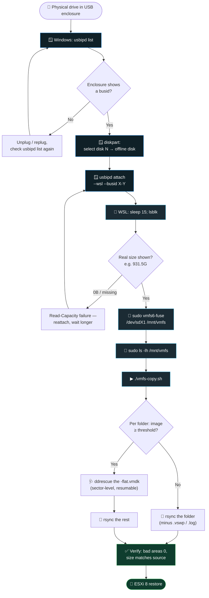
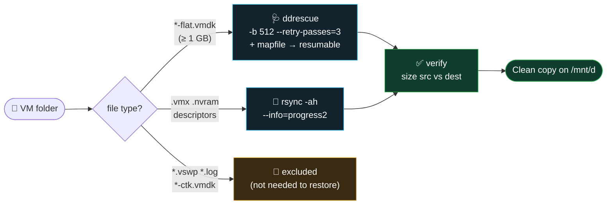
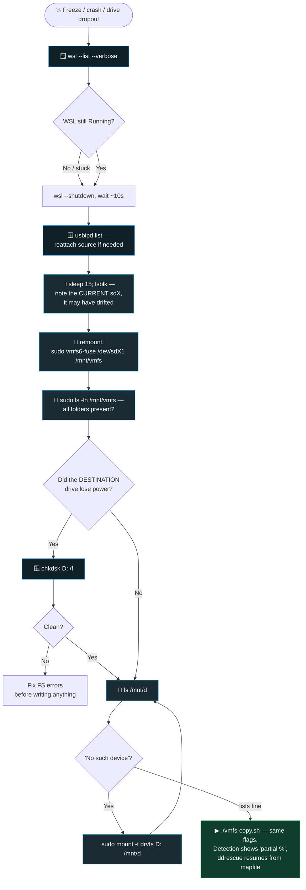
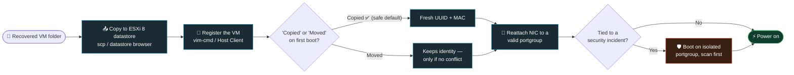

<!-- ════════════════════════════════════════════════════════════════════════ -->
<!--                            HERO  /  3D BANNER                             -->
<!-- ════════════════════════════════════════════════════════════════════════ -->

<div align="center">

<a href="https://github.com/aniksarakash/VFMS_Recovery">
  
</a>

<br/>

<a href="https://git.io/typing-svg">
  
</a>

<br/><br/>

<!-- ── NAV BADGES (anchor links, for-the-badge) ─────────────────────────── -->
<a href="#tldr"></a>
<a href="#-quick-start"></a>
<a href="#-the-copier-script"></a>
<a href="#-full-walkthrough"></a>
<a href="#-troubleshooting-reference"></a>
<a href="#-frequently-asked-questions"></a>
<a href="#-restoring-on-esxi-8"></a>

<br/>

<!-- ── STATUS BADGES (flat-square) ──────────────────────────────────────── -->


<br/><br/>

<!-- ── TECH STACK ICONS ─────────────────────────────────────────────────── -->


</div>


<!-- ════════════════════════════════════════════════════════════════════════ -->

<a id="tldr"></a>

> [!NOTE]
> **The 20-second version.** A drive that used to back a VMware **VMFS6** datastore is now sitting in a **USB enclosure**. Windows sees it but can't read the filesystem. This repo attaches it into **WSL2**, mounts it with `vmfs6-fuse`, then runs one interactive script — [`vmfs-copy.sh`](vmfs-copy.sh) — that **`ddrescue`s the big disk images** (retry + resume on bad sectors) and **`rsync`s the metadata**, with a **live progress bar, folder detection, and interactive selection**. Copy lands on your `D:` drive; then you register the VM on a fresh **ESXi 8** host. Every failure mode below actually happened during a real recovery.

<br/>

## 📌 What This Repository Is

**VMFS Recovery** is a field-tested playbook plus one Bash script — [`vmfs-copy.sh`](vmfs-copy.sh) — for **recovering VMware virtual machines from a bare VMFS6 datastore disk**: a drive that has been physically pulled out of an ESXi host and plugged into a Windows PC through a USB enclosure.

**The problem.** Windows cannot read VMFS. There is no native Windows VMFS driver, so the disk shows up in Disk Management as a healthy partition with no drive letter, no recognized filesystem, and an offer to format it. Nothing on it is damaged — Windows simply doesn't speak the filesystem.

**The method.** `usbipd-win` passes the USB disk through to **WSL2**, `vmfs6-fuse` mounts the VMFS6 volume inside Linux, and `vmfs-copy.sh` copies each VM folder out with the right tool per file: **`ddrescue`** for the multi-gigabyte `-flat.vmdk` disk images (bad-sector retries, resumable via mapfile) and **`rsync`** for the small `.vmx` / `.nvram` / descriptor files.

**The result.** A complete, restorable VM folder on an ordinary NTFS drive, ready to register on a fresh **ESXi 8** host with `vim-cmd solo/registervm`. **No working hypervisor is needed to read the disk** — only WSL2.

**Who it's for.** Anyone holding a VMFS disk from a failed, decommissioned, or compromised ESXi host, with no running host left to plug it back into.

> [!TIP]
> **About the spelling.** The filesystem is **VMFS** — *Virtual Machine File System*. This repository's name transposes the letters as `VFMS_Recovery`. If you got here searching for **VFMS recovery**, **VMFS recovery** is the correct term, and this is the right place.

<br/>

## 🧭 Table of Contents

<table>
<tr>
<td width="50%" valign="top">

**Getting the data out**
- [📌 What This Repository Is](#-what-this-repository-is)
- [🎯 When to Use This](#-when-to-use-this)
- [🧱 Prerequisites](#-prerequisites)
- [🗺 The Process at a Glance](#-the-process-at-a-glance)
- [⚡ Quick Start](#-quick-start)
- [🖥 The Copier Script](#-the-copier-script)
- [📖 Full Walkthrough](#-full-walkthrough)

</td>
<td width="50%" valign="top">

**When things go sideways · getting it back up**
- [♻ Recovering After a Crash](#-recovering-after-a-crash-power-loss-or-wsl-restart)
- [🚀 Restoring on ESXi 8](#-restoring-on-esxi-8)
- [🔧 Troubleshooting Reference](#-troubleshooting-reference)
- [🧾 Exact Error Messages, Decoded](#-exact-error-messages-decoded)
- [❓ Frequently Asked Questions](#-frequently-asked-questions)
- [🎛 Script Reference](#-script-reference-flags--internals)
- [🗒 Field Notes](#-field-notes)
- [🙋 Author & License](#-author--license)

</td>
</tr>
</table>


## 🎯 When to Use This

The drive is **no longer in an ESXi host** — it's out, in an enclosure, plugged into a USB port. Windows Disk Management shows it as a single healthy *"Primary Partition"* with **no drive letter and no recognized filesystem** (Windows can't read VMFS natively) and refuses to mount it. **That's the signal you're in the right place.**

<div align="center">

| You have… | This repo gives you… |
|---|---|
| 🔌 A bare VMFS drive in a USB enclosure | A WSL2 attach + mount recipe that actually works |
| 💾 50–100 GB+ `-flat.vmdk` disk images | `ddrescue` with retries + a **resumable** mapfile |
| 🧩 Small `.vmx` / `.nvram` / descriptor files | `rsync`, fast, with swap/log files excluded |
| ⚠ A drive with **bad sectors** | Sector-level recovery instead of a hard mid-copy fail |
| 🧨 A crash / power-loss / WSL freeze mid-copy | A step-by-step **resume** sequence — never restarts from zero |
| 🚀 A fresh ESXi 8 host to restore onto | `vim-cmd` register + first-boot handling |

</div>

> [!WARNING]
> **If this recovery follows a security incident** rather than a hardware failure, don't power the recovered VM straight onto a production network. Boot it on an **isolated/quarantine portgroup**, scan it, *then* reconnect. More in the [restore section](#-restoring-on-esxi-8).


## 🧱 Prerequisites

| Tool | Runs on | Purpose | Install |
|---|---|---|---|
| **`usbipd-win`** | Windows | Shares a USB device into WSL2's Linux kernel | `winget install usbipd` · or the [releases page](https://github.com/dorssel/usbipd-win/releases) |
| **WSL2** (Ubuntu) | Windows | A real Linux kernel that can read VMFS | `wsl --install` |
| **`vmfs6-fuse`** | WSL2 | FUSE driver to mount a VMFS6 volume | via `vmfs6-tools` — package manager first, else build from source |
| **`gddrescue`** (→ `ddrescue`) | WSL2 | Sector-level recovery for a degrading drive | `sudo apt install gddrescue` |
| **`rsync`** | WSL2 | Bulk copy for everything that isn't a giant image | usually preinstalled · else `sudo apt install rsync` |

> [!TIP]
> **Known-good enclosure fingerprint for this workflow: `0bda:9210`** (Realtek UAS bridge). A different VID:PID claiming to be mass storage — a `152d:0583` or `0bda:9201` decoy has shown up before — **is not it.** Always confirm the VID:PID in `usbipd list` before attaching.


## 🗺 The Process at a Glance




<div align="center">
  
</div>

## ⚡ Quick Start

Already mounted the datastore and just want the files off it? Three lines:

```bash
# 1) grab this repo inside WSL
git clone https://github.com/aniksarakash/VFMS_Recovery.git && cd VFMS_Recovery
chmod +x vmfs-copy.sh

# 2) point it at the mount and your destination drive, then pick folders interactively
./vmfs-copy.sh --src /mnt/vmfs --dest /mnt/d
```

Don't have it mounted yet? The **full attach → mount → copy** path is in the [walkthrough](#-full-walkthrough). The one-liner that mounts it:

```bash
sudo mkdir -p /mnt/vmfs && sudo vmfs6-fuse /dev/sdd1 /mnt/vmfs   # sdX drifts — run lsblk first
```


## 🖥 The Copier Script

[`vmfs-copy.sh`](vmfs-copy.sh) is the heart of this repo — one interactive tool that **detects** every VM folder, lets you **select** which to pull, and copies each with the **right engine per file** and a **live progress bar**. It's built to be re-run: `ddrescue` mapfiles mean an interrupted copy **resumes**, it never restarts a disk image from zero.

### What a run looks like

```text
  VMFS recovery copier
  ────────────────────────────────────────────────────────────────────────
  ✓ Source mounted: /mnt/vmfs
  ✓ sudo cached (VMFS files are root-only, mode 600)
  ✓ ddrescue: /usr/bin/ddrescue
  ✓ Destination: /mnt/d  (244.4G free)
  ✓ Mapfiles/logs: /mnt/d/.vmfs-recovery

  Scanning /mnt/vmfs ...

  #   VM FOLDER                                     SIZE  DISKS  DEST
  ────────────────────────────────────────────────────────────────────────
  1   IP_44.10_MyQ test Server                    94.4G      1  absent
  2   Ticketing_System_Production Server          61.2G      1  partial 38%
  3   44.20_Software                              48.9G      1  complete
  ────────────────────────────────────────────────────────────────────────
  3 folders, 204.5G to copy (excludes .vswp/.log). DISKS = .vmdk images >= 1024MB (ddrescue candidates).

  Select folders [e.g. 1 3, 1-3, all, q]: 1-2

  [1/2] IP_44.10_MyQ test Server
  ────────────────────────────────────────────────────────────────────────
    ddrescue -> IP_44.10_MyQ test Server-flat.vmdk (94.4G)
    [############################..........]  74.19%  118MB/s  bad:0  12m03s
```

<div align="center">

`absent` · `partial 38%` · `complete` — the **DEST** column tells you at a glance what's already been copied, so a resumed run only touches what's left.

</div>

### The three things it does that a plain `cp` won't



1. **`ddrescue` for the big disk images** — retries and works *around* bad sectors instead of failing the whole file. The mapfile records exactly what's been read, so a re-run resumes.
2. **`rsync` for everything small** — running `ddrescue` file-by-file on a 4 KB `.vmx` gains nothing; `rsync` is faster and handles them in one shot.
3. **Excludes what a restore doesn't need** — `*.vswp` swap and `*.log` files are skipped by default (keep the logs with `--keep-logs`).

> [!TIP]
> **Test the plan before committing to it:** `./vmfs-copy.sh --dry-run` prints the detection table, the space check, and exactly what *would* be copied — and stops. Nothing is written.


## 📖 Full Walkthrough

<details open>
<summary><strong>Step 1 — Identify &amp; offline the drive (Windows)</strong></summary>

<br/>

```powershell
usbipd list
```

Confirm the enclosure is present and note its **busid**. Its known fingerprint is **`0bda:9210`**. Then offline the disk so Windows releases its lock before WSL claims it:

```
diskpart
DISKPART> list disk
DISKPART> select disk 1
DISKPART> offline disk
```

> [!IMPORTANT]
> The disk number isn't fixed — confirm it against the **size** (e.g. 931 GB) in `list disk` every time. Don't assume it's always `disk 1`.

</details>

<details>
<summary><strong>Step 2 — Attach to WSL2</strong></summary>

<br/>

```powershell
usbipd attach --wsl --busid 3-2
```

In WSL, give the kernel time to enumerate it before checking:

```bash
sleep 15
lsblk
```

You want the drive at its **real size** (e.g. `931.5G`), not `0B`. A partition like `sdd1` with no mountpoint yet is correct here — attached but not mounted.

</details>

<details>
<summary><strong>Step 3 — Mount the VMFS volume</strong></summary>

<br/>

```bash
sudo mkdir -p /mnt/vmfs
sudo vmfs6-fuse /dev/sdd1 /mnt/vmfs
sudo ls -lh /mnt/vmfs          # always sudo — the VM files are root-only
```

A `Lun ID mismatch` warning here is **expected and harmless** (see [Troubleshooting](#-troubleshooting-reference)).

</details>

<details>
<summary><strong>Step 4 — Run the copier</strong></summary>

<br/>

```bash
./vmfs-copy.sh --src /mnt/vmfs --dest /mnt/d
```

Pick folders when prompted (`1 3`, `1-3`, `all`, or `q`). The script handles the per-file engine choice, the progress bar, and the size verification for you. Prefer the manual approach or want to understand what it runs under the hood? The equivalent by hand:

```bash
SRC="/mnt/vmfs"; DEST="/mnt/d"
folder="IP_44.10_MyQ test Server"

sudo mkdir -p "$DEST/$folder" "$DEST/.vmfs-recovery"
# big disk image → ddrescue (resumable via mapfile)
sudo ddrescue -v -b 512 --retry-passes=3 \
  "$SRC/$folder/$folder-flat.vmdk" "$DEST/$folder/$folder-flat.vmdk" \
  "/mnt/d/.vmfs-recovery/${folder// /_}.map"
# everything else → rsync
sudo rsync -avh --progress "$SRC/$folder/" "$DEST/$folder/" \
  --exclude='*-flat.vmdk' --exclude='*.vswp' --exclude='*.log'
```

</details>

<details>
<summary><strong>Step 5 — Verify</strong></summary>

<br/>

The script prints a `Verified: … (100.0%)` line per folder. To double-check by hand, every `-flat.vmdk` that went through `ddrescue` should end with:

```
rescued: 96636 MB,   bad areas: 0,   run time: ...
```

**`bad areas: 0`** (equivalently `errsize: 0` in the mapfile) = a clean, complete recovery. If it's non-zero, see [Troubleshooting](#-troubleshooting-reference). And a quick size sanity check:

```bash
sudo du -sh "/mnt/vmfs/$folder"
sudo du -sh "/mnt/d/$folder"
```

</details>


## ♻ Recovering After a Crash, Power Loss, or WSL Restart

Running multiple `ddrescue`/`rsync` jobs at once against a USB-attached drive, through WSL2's virtualized USB stack, is more fragile than it looks — in practice it has hung WSL and browned out a bus-powered enclosure under combined current draw. This is the recovery sequence, **in order** — each step assumes the previous one is confirmed working.



> [!NOTE]
> **Why resuming is safe.** `ddrescue` reads its mapfile and only re-attacks sectors not already marked rescued; `rsync` only re-sends files that are missing or changed. Neither restarts from zero. What breaks in a crash isn't the recovery logic — it's the layers underneath (WSL's VM state, the drvfs bridge, the USB attachment, enclosure power) that need re-establishing.

> [!CAUTION]
> **If the destination drive lost power specifically,** a clean `chkdsk /f` confirms the filesystem structure — but *not* that the file being written at the crash is complete to the last byte (a hard power loss can drop the drive's write cache). Treat `bad areas: 0` after resuming, or a final size match against the source, as the real confirmation — not chkdsk alone.

**One habit that prevents most of the confusion here:** run `lsblk` fresh immediately before referencing any `/dev/sdX` path. Device letters drift across detach/reattach cycles — a path that was `sdd1` earlier may be `sde1` later for the exact same physical drive.


## 🚀 Restoring on ESXi 8

After the copy, each recovered folder should hold: the small text descriptor `VMName.vmdk`, the large `VMName-flat.vmdk`, `VMName.vmx`, `VMName.nvram`, maybe `.vmsd`. (The script excludes `*.vswp` swap and `*.log`; keep logs with `--keep-logs` — harmless, just not needed.)



**1. Get the files onto the datastore.**

```bash
# Option A — scp (enable SSH: Host Client → Manage → Services → TSM-SSH → Start)
scp -r "/mnt/d/IP_44.10_MyQ test Server" root@<esxi-host-ip>:/vmfs/volumes/<datastore>/
```
*Option B* — Host Client → Storage → Datastore Browser → **Upload Folder**. Simpler for a one-off, slower for very large files.

**2. Register the VM** (so ESXi uses the recovered disk, not a blank one from the New VM wizard):

```bash
vim-cmd solo/registervm "/vmfs/volumes/<datastore>/IP_44.10_MyQ test Server/IP_44.10_MyQ test Server.vmx"
vim-cmd vmsvc/getallvms
```

**3. Power on & handle first-boot prompts:**

```bash
vim-cmd vmsvc/power.on <Vmid>
```

- Asked **copied vs moved**? Choose **"I copied it"** unless it's a guaranteed 1:1 replacement — "copied" issues a fresh UUID/MAC and avoids conflicts.
- The NIC will likely show disconnected (the old portgroup doesn't exist here) — fix under VM Settings → Network Adapter.
- A hardware-compatibility complaint → use **Upgrade VM Compatibility**, don't rebuild.

**4. If the descriptor `.vmdk` is missing or suspect,** regenerate it against the flat file rather than hand-editing geometry — this doubles as an integrity check:

```bash
vmkfstools -i "/vmfs/volumes/<datastore>/VMName/VMName.vmdk" \
             "/vmfs/volumes/<datastore>/VMName/VMName-imported.vmdk" -d thin
```

> [!WARNING]
> **Security-incident note.** If this is incident response rather than a plain hardware failure, don't plug the restored VM straight into production. Power it on with the NIC on an **isolated/quarantine** portgroup, let it get scanned, then reconnect. And if any `-flat.vmdk` had a non-zero `errsize`, expect some in-guest damage — run `chkdsk /f` (Windows guest) or `fsck` (Linux) after boot to contain it.


## 🔧 Troubleshooting Reference

<details>
<summary><strong>🔧 lsblk shows the drive at 0B (or not at all) right after attaching</strong></summary>

<br/>**Cause:** the kernel hasn't finished enumerating the device, or it attached in a mode that triggers a `Read Capacity` failure.

**Fix:**
- Wait longer — `sleep 15`, sometimes 20–30s on a slower enclosure.
- Detach/reattach: `usbipd detach --busid X-Y`, then `usbipd attach --wsl --busid X-Y`.
- Check enumeration in `usbipd list`. A plain `USB Mass Storage Device` (legacy mode) has been more failure-prone than `USB Attached SCSI (UAS) Mass Storage Device` — **UAS mode is the reliable one** for this enclosure.
</details>

<details>
<summary><strong>🔧 The enclosure disappears from <code>usbipd list</code> entirely</strong></summary>

<br/>**Cause:** a USB bus re-enumeration hiccup, usually right after a Windows-side disk state change like offlining it in `diskpart`.

**Fix:** physically unplug and replug the enclosure, then `usbipd list` again. Confirm the VID:PID before attaching — this enclosure is **`0bda:9210`**. A different device coincidentally showing as mass storage isn't it.
</details>

<details>
<summary><strong>🔧 Permission denied on <code>ls /mnt/vmfs</code> right after mounting</strong></summary>

<br/>**Cause:** the mount was done with `sudo`, so the FUSE mount is root-owned with `default_permissions`, and the VM files underneath are `-rw-------` (mode 600) — normal for VMFS.

**Fix:** nothing's broken — prefix every command touching `/mnt/vmfs` with `sudo`. (`vmfs-copy.sh` does this for you, and caches the sudo timestamp so it won't re-prompt mid-copy.)
</details>

<details>
<summary><strong>🔧 <code>VMFS: Warning: Lun ID mismatch</code> when mounting</strong></summary>

<br/>**Cause:** the volume's metadata still carries the LUN ID from the original host's controller, which won't match a USB enclosure. Expected any time you read a VMFS volume through different hardware than it was created on.

**Fix:** none needed — it's a warning, not a failure. The mount proceeds.
</details>

<details>
<summary><strong>🔧 rsync (or cp) dies mid-transfer with an I/O error / "file has vanished"</strong></summary>

<br/>**Cause:** a physically bad sector on the source. `rsync`/`cp` don't retry — they fail the file and stop.

**Fix:** confirm with `dmesg | tail -30` (a repeated I/O error at the same LBA). Switch that one file to `ddrescue` — which is exactly what `vmfs-copy.sh` already routes every `-flat.vmdk` through:
```bash
sudo ddrescue -v -b 512 --retry-passes=3 "SOURCE" "DEST" "MAPFILE.map"
```
Everything that already copied cleanly stays copied — no need to redo it.
</details>

<details>
<summary><strong>🔧 ddrescue finishes with a non-zero <code>errsize</code> / bad areas</strong></summary>

<br/>**Cause:** some sectors are permanently unreadable even after retries.

**Options:**
- Re-run the exact same command / re-run `vmfs-copy.sh` — it resumes from the mapfile and only re-attacks bad areas, so another pass is cheap.
- Two-phase for a large file: a fast `ddrescue -n` pass (no retries, grabs everything easy), then a focused retry pass on the same mapfile.
- If it stays non-zero, that data is gone. The mapfile records exactly which regions — repair the rest in-guest post-restore with `chkdsk`/`fsck`.
</details>

<details>
<summary><strong>🔧 Destination drive doesn't show up under <code>/mnt/</code> in WSL</strong></summary>

<br/>**Cause:** either the drive letter isn't initialized on the Windows side, or WSL's automount hasn't picked it up.

**Fix:** confirm it has a letter in Windows Disk Management, then mount manually:
```bash
sudo mkdir -p /mnt/d
sudo mount -t drvfs D: /mnt/d
```
</details>

<details>
<summary><strong>🔧 WSL becomes unresponsive after multiple concurrent jobs</strong></summary>

<br/>**Cause:** several I/O-heavy jobs in parallel through WSL2's virtualized USB stack is fragile — it can hang the WSL VM itself.

**Fix:** from Windows, `wsl --list --verbose` to check whether WSL is actually still running (sometimes it's just the terminal that's stuck). If it's genuinely hung, `wsl --shutdown` resets cleanly — then follow [Recovering After a Crash](#-recovering-after-a-crash-power-loss-or-wsl-restart). Nothing already on disk is lost.

**Prevention:** one copy operation at a time against a given physical drive — which is exactly how `vmfs-copy.sh` runs by design (folders are processed sequentially, never in parallel).
</details>

<details>
<summary><strong>🔧 The USB enclosure disconnects mid-copy (drive drops out)</strong></summary>

<br/>**Cause:** often power, not software — a spinning HDD under multiple concurrent read streams draws more current than one sequential stream. A bus-powered enclosure on a marginal supply can brown out.

**Fix:** reconnect (`usbipd list` → `usbipd attach`), then confirm with `dmesg -T | tail -50` — look for I/O errors or a device reset around that time, and nothing repeating after.

**Prevention:** use the enclosure's own power adapter; if bus-powered only, route through a *powered* USB hub. Short, known-good cable. And one job at a time — the script already enforces that.
</details>


## 🧾 Exact Error Messages, Decoded

The literal strings this recovery produces, so you can match what's on your screen. Most of them are **not** failures.

| What you see | Where | What it actually means | Do this |
|---|---|---|---|
| `VMFS: Warning: Lun ID mismatch` | `vmfs6-fuse` mount | The volume still records the original host's LUN ID, which a USB enclosure can't match | **Nothing.** It's a warning; the mount succeeds |
| `ls: cannot open directory '/mnt/vmfs': Permission denied` | after mounting | VM files on VMFS are mode `600` and the FUSE mount is root-owned | Prefix with `sudo` (the script does this for you) |
| `lsblk` shows the disk as `0B` | after `usbipd attach` | The kernel hit a `Read Capacity` failure or hasn't finished enumerating | `sleep 15`, then detach and reattach |
| `Input/output error` | mid-copy | A physically unreadable sector on the source | Route that file through `ddrescue`, not `cp`/`rsync` |
| `rsync: ... file has vanished` | mid-copy | Same bad-sector read failure, reported by `rsync` | Confirm with `dmesg \| tail -30`, then use `ddrescue` |
| `bad areas: 1` (or any non-zero `errsize`) | end of `ddrescue` | Sectors that stayed unreadable after retries | Re-run to retry cheaply; if it persists, that data is gone |
| `ls: cannot access '/mnt/d': No such device` | destination | WSL's `drvfs` bridge to the Windows drive dropped | `sudo mount -t drvfs D: /mnt/d` |
| `/dev/sdd1 does not exist` | remount after a crash | The device letter drifted across reattach | Run `lsblk` fresh and use the **current** `sdX` |
| `/usr/bin/env: 'bash\r': No such file or directory` | running the script | The file was saved with Windows CRLF line endings | `sed -i 's/\r$//' vmfs-copy.sh` (this repo pins LF via `.gitattributes`) |
| `The disk is offline because of policy set by an administrator` | Windows `diskpart` | Expected — you offlined it on purpose so WSL can claim it | Nothing; this is the goal |
| `This virtual machine might have been moved or copied` | ESXi first boot | ESXi noticed a new UUID/path | Answer **"I copied it"** unless it's a guaranteed 1:1 replacement |
| `Failed to lock the file` | ESXi power-on | The disk is already registered or held by another VM | Unregister the duplicate, then power on |


## ❓ Frequently Asked Questions

### Can Windows read a VMFS drive?

No. Windows has no native VMFS driver, so a VMFS disk appears in Disk Management as a healthy partition with **no drive letter and no recognized filesystem**, and Windows offers to format it. Nothing is wrong with the disk — Windows just can't parse VMFS. **Do not let it format the disk.** Read it from Linux instead: this repo passes the disk into WSL2 and mounts it with `vmfs6-fuse`.

### How do I mount a VMFS6 datastore on Windows 11?

Through WSL2, in four steps: offline the disk in `diskpart` so Windows releases its lock, share and attach it with `usbipd attach --wsl --busid X-Y`, confirm it appears at full size in `lsblk`, then mount it inside Linux with `sudo vmfs6-fuse /dev/sdX1 /mnt/vmfs`. Every command touching the mount needs `sudo`, because VMFS files are mode `600`.

### Can I recover VMs from a VMFS disk without an ESXi host?

Yes. You never need a hypervisor to *read* the disk — `vmfs6-fuse` in WSL2 is enough to mount the datastore and copy the VM folders off. You only need an ESXi host at the end, to *run* the recovered VM. The recovered folder is ordinary files, so you can keep it on an NTFS drive indefinitely and restore it whenever a host is available.

### Should I use ddrescue or rsync to copy a VMDK?

Use **`ddrescue` for the large `-flat.vmdk` disk images** and **`rsync` for everything else**. `rsync` and `cp` abort the whole file on the first unreadable sector, which is exactly the wrong behavior on a drive you suspect is dying. `ddrescue` retries, works *around* bad sectors, and records progress in a mapfile so an interrupted copy resumes. For 4 KB `.vmx` and descriptor files `ddrescue` buys nothing, and `rsync` moves them in one pass.

### How do I resume an interrupted ddrescue copy?

Re-run the **exact same command with the same mapfile path**. `ddrescue` reads the mapfile, skips every range already marked rescued, and attacks only the gaps. Re-running `vmfs-copy.sh` with the same flags does this automatically. The one thing that breaks resume is losing the mapfile — which is why this script keeps mapfiles next to the **destination** (`<dest>/.vmfs-recovery`) rather than under `$HOME`, since running under `sudo` changes `$HOME` to `/root` and would look in the wrong directory.

### Does resuming a ddrescue copy re-read everything first?

No, and it doesn't take twice as long. Already-rescued ranges are skipped without being read or rewritten — a resumed run of a finished image reports `tried: 0 B` and completes in about a second. A hard crash can cost at most the last mapfile flush (roughly 30 seconds of progress). Note that the log line `Starting positions: infile = 0 B, outfile = 0 B` appears even on a perfect resume, so it does **not** mean a restart — check `tried:` instead.

### Why does a folder show "partial" when the copy already finished?

Because a percentage measured against the *raw* source size can never reach 100% once files are deliberately excluded. `vmfs-copy.sh` skips `*.vswp` swap files, `*-ctk.vmdk` change-tracking maps, and `*.log`, so a folder holding a 24 GB `.vswp` would read "partial" forever. The script now compares **copyable** bytes on both sides, so a genuinely complete folder reports `complete`. A real shortfall is still flagged.

### Do I need the .vswp file to restore a VM?

No. A `.vswp` file is the VM's memory swap, created fresh by the host at power-on and meaningless once the VM is off. It's also frequently the largest file in the folder — often tens of gigabytes — so copying it wastes hours and space. The same goes for `*-ctk.vmdk` change-tracking files and `vmware-*.log`. All are excluded by default.

### What does `bad areas: 0` mean in ddrescue output?

It means **every sector was read successfully — a clean, complete recovery.** It's the single number worth checking before you trust a recovered disk image; the equivalent field in the mapfile is `errsize: 0`. A matching file size is reassuring but weaker: a size match only proves the right number of bytes exist, while `bad areas: 0` proves they were all actually read from the source.

### ESXi asks "I copied it" or "I moved it" on first boot — which do I pick?

Pick **"I copied it"**. That issues a fresh UUID and MAC address, which avoids colliding with the original VM if it ever comes back online. Choose "I moved it" only when this host is a guaranteed 1:1 replacement and the original will never run again — it preserves the identity, including the MAC, which is what you want if something is licensed to it.

### Is it safe to mount a VMFS volume with vmfs6-fuse?

Mounting is safe, and this workflow only ever reads. Treat the source as strictly read-only for the duration of a recovery: never write to `/mnt/vmfs`, never repartition or "repair" the source disk, and get a verified copy off it first. If the drive is degrading, every extra read costs you something — which is why resume support matters, and why running one copy at a time is deliberate.

### Does this work on VMFS5 instead of VMFS6?

Yes, with a different FUSE driver. Use `vmfs-fuse` from **`vmfs-tools`** for VMFS3/VMFS5 volumes, and `vmfs6-fuse` from **`vmfs6-tools`** for VMFS6. Everything downstream — the `ddrescue` and `rsync` strategy, `vmfs-copy.sh`, the ESXi 8 restore — is identical, since it all operates on ordinary files once the volume is mounted.

### Why does WSL2 hang during a large USB copy?

Because several I/O-heavy jobs running at once through WSL2's virtualized USB stack is fragile enough to hang the WSL VM itself, and a bus-powered enclosure can brown out under the combined current draw of multiple read streams. Run **one copy at a time** against a given physical drive — `vmfs-copy.sh` processes folders sequentially by design — and power the enclosure from its own adapter or a powered hub.


## 🎛 Script Reference (flags & internals)

```text
./vmfs-copy.sh [options]
```

| Flag | Default | Does |
|---|---|---|
| `--src <path>` | `/mnt/vmfs` | Where `vmfs6-fuse` mounted the datastore |
| `--dest <path>` | `/mnt/d` | Destination drive |
| `--mapdir <path>` | `<dest>/.vmfs-recovery` | Where `ddrescue` mapfiles + per-file logs live |
| `--big-mb <N>` | `1024` | `.vmdk` files ≥ N MB go through `ddrescue`; smaller via `rsync` |
| `--all`, `-a` | off | Select every folder, skip the picker |
| `--yes`, `-y` | off | Assume "yes" to the start/space prompts |
| `--no-ddrescue` | off | `rsync` everything (faster, **no** bad-sector retry) |
| `--keep-logs` | off | Also copy `vmware-*.log` files |
| `--dry-run`, `-n` | off | Print the plan + space check, copy nothing |
| `--no-sudo` | off | Already root / source is readable — call tools directly |
| `--help`, `-h` | — | Usage |

**Design choices baked in:**

- 🔁 **Resumable by default** — mapfiles persist in `--mapdir`; re-running never restarts a disk image from zero.
- 🧮 **Space check before it starts** — refuses (or warns) if the selection won't fit on the destination.
- 🎚 **Sequential, never parallel** — one folder at a time, because concurrent USB I/O is what browns out enclosures and hangs WSL.
- 🧾 **Verifies every folder** — compares apparent size of source vs destination and flags any real shortfall (excluded `.vswp`/`.log` are accounted for).
- 🖱 **Flexible selection** — `1 3`, ranges `1-3`, `all`, or `q` to bail; de-duplicates overlapping picks.
- 🎨 **Degrades gracefully** — no `ddrescue`? Falls back to `rsync`. No TTY? Drops the colors. Not root and no `sudo`? Warns instead of dying.

> [!NOTE]
> **Common flag combos.** `--all --yes` = unattended full pull. `--dry-run` = see the plan, touch nothing. `--big-mb 512` = treat 512 MB+ images as `ddrescue` candidates. `--no-ddrescue` = healthy drive, want speed over bad-sector resilience.


## 🗒 Field Notes

- These are **personal field notes from a real recovery session**, not official VMware/Broadcom documentation — cross-check anything safety-critical against current vendor docs, especially exact CLI flags, which shift between ESXi releases.
- **Busid numbers, `/dev/sdX` letters, drive letters, and folder names will all differ next time.** Only the *shape* of the process stays the same — that's what the diagrams and the script are for.
- **Known-good enclosure:** `0bda:9210` (Realtek UAS bridge). It's shown power sensitivity under concurrent multi-stream I/O — run one copy operation at a time against it. The script does this by default.
- **`bad areas: 0` is the number that matters.** A size match is a good sign; a clean `ddrescue` summary is the proof.
- **Last verified: 24 August 2026** — Windows 11 Pro (build 26200), WSL2 Ubuntu, GNU `ddrescue` 1.27, against a 931 GB VMFS6 volume in a Realtek `0bda:9210` enclosure.
- **Machine-readable summaries live alongside this README** — [`llms.txt`](llms.txt) for LLMs and answer engines, [`CITATION.cff`](CITATION.cff) if you need to cite this.


## 🙋 Author &amp; License

<div align="center">

**Anik Sarker Akash**

<a href="https://github.com/aniksarakash"></a>

Released under the **MIT License** — use it, adapt it, recover your data with it.

</div>

<br/>


## 🔎 Also Known As

The phrasings people actually use for this problem. If any of these is what you searched for, you're in the right place.

**The filesystem** — VMFS · VMFS6 · VMFS5 · **VFMS** *(common transposition of VMFS)* · Virtual Machine File System · VMware datastore · `-flat.vmdk` · flat VMDK · VMDK descriptor file · `.vmx` · `.nvram`

**The situation** — recover a VMware VM from a bare VMFS drive · read a VMFS disk on Windows · VMFS drive shows no filesystem in Disk Management · Windows wants to format my VMFS disk · drive pulled from a dead ESXi host · recover VMs without an ESXi host · ESXi host failed but the disk is fine · decommissioned ESXi host data recovery · VMFS datastore in a USB enclosure · read a VMware datastore without vSphere · get VMs off a hypervisor that won't boot

**The tooling** — mount VMFS in WSL2 · `vmfs6-fuse` · `vmfs6-tools` · `vmfs-fuse` · `usbipd-win` · `usbipd attach --wsl` · WSL2 USB passthrough · `diskpart offline disk` · `drvfs` · `ddrescue` VMDK bad sectors · GNU ddrescue mapfile · resume an interrupted ddrescue · `rsync` exclude `.vswp` · Realtek `0bda:9210` UAS enclosure

**The restore** — register a recovered VM on ESXi 8 · `vim-cmd solo/registervm` · `vmkfstools -i` to regenerate a descriptor · "I copied it" vs "I moved it" · reattach the NIC portgroup after a restore · upgrade VM compatibility

**Adjacent problems this covers** — VMFS data recovery on Windows 11 · virtual machine disaster recovery runbook · bad-sector recovery for very large disk images · resumable multi-hundred-gigabyte copy over USB · post-incident ESXi recovery onto a quarantine portgroup

<br/>

<div align="center">
  
</div>
